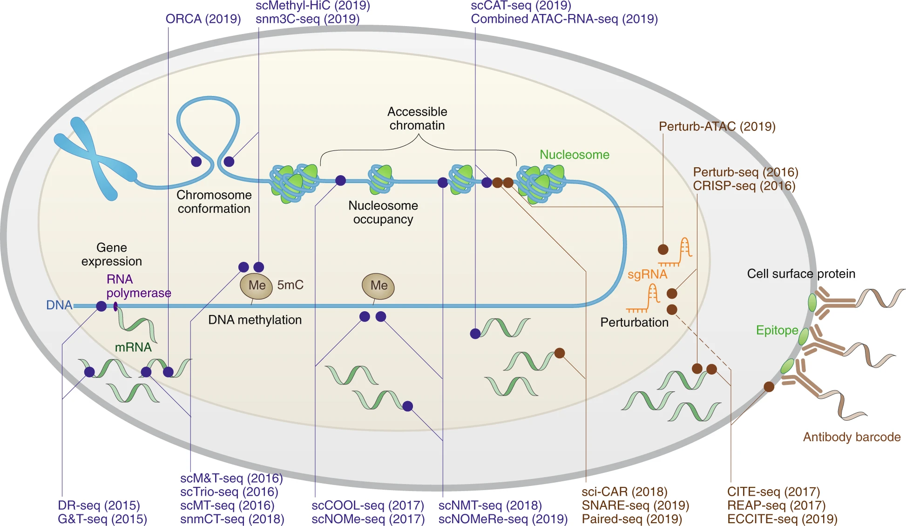

# Experimental data collection

This chapter, which is aimed at bioinformatians, provides a short introduction to sequencing and the most widely used single-cell RNA sequencing assays. Multimodal or spatial assays are not covered here, but instead in the respective advanced chapters. All sequencing assays have individual strengths and limitations which must be known by data analysis to be aware of possible biases in the data. The count distribution and gene coverage for example is heavily influenced by the chemistry of the assay.

:::{figure-md} markdown-fig


Sequencing assays overview. Image obtained from <https://www.nature.com/articles/s41592-019-0691-5> WE HAVE NO RIGHTS AND THIS NEEDS TO BE REDONE OR RECONSIDERED.
:::

## A brief history of sequencing

### First generation sequencing

Although DNA was already first isolated in 1869 by Friedrich Mietscher it took the scientific community more than 100 years to develop high throughput sequencing technologies. In 1953 Watson, Crick and Franklin discovered the structure of DNA and in 1965 Robert Holley sequenced the first tRNA. Seven years later, in 1972, Walter Fiers was the first to sequence the DNA of a complete gene (MS2) using RNAses to digest the virus RNA and isolate oligonucleotides and finally separating them with electrophoresis and chromatography{cite}`JOU1972`. In parallel, Friedrich Sanger developed a DNA sequencing method that uses radiolabelled partially digested fragments termed "chain termination method", which is more commonly known as "Sanger Sequencing". Although, Sanger Sequencing is still used even today, it suffered from several short comings: It lacked automation and was time consuming. In 1987 Leroy Hood and Michael Hunkapiller developed the ABI 370, an instrument that automates the Sanger Sequencing process. The most important innovation to accomplish this was the automatic labelling of DNA fragments with fluorescent dies instead of radioactive molecules. This allowed for computers to analyze the acquired data{cite}`Hood1987`.

Strengths:

* Sanger sequencing is simple and does not require expensive machines.
* If done well, the error rate is very low.

Limitations:

* Sanger methods can only sequence short pieces of DNA - about 300 to 1000 base pairs.
* The quality of a Sanger sequence is often not very good in the first 15 to 40 bases because that is where the primer binds.
* Sequencing degrades after 700 to 900 bases.
* If the DNA fragment being sequenced has been cloned, some of the cloning vector sequence may find its way into the final sequence.
* Sanger sequencing is more expensive than second or third generation sequencing.

### Second generation sequencing

Second generation sequencing is also known as next-generation sequencing (NGS) which was primarily made possible by automation in the lab, the usage of computers and the miniaturisation of reactions. Nine years later, in 1996, Mostafa Ronaghi, Mathias Uhlen and Pȧl Nyŕen introduced a new DNA sequencing technique called pyrosequencing introducing the age of second generation sequencing. Pyrosequencing measures luminescence that is generated by pyrophosphate synthesis during sequencing. This process is also commonly known as "sequencing-by-synthesis"). Two years later, Shankar Balasubramanian and David Klenerman, developed adapted the sequencing-by-synthesis process for a new method which utilises fluorescent dyes at the company Solexa. The Roche 454 sequencer developed in 2005, was the first sequencer to fully automate the pyrosequencing process in a single, automated machine. Although, many other platforms such as SOLiD systems' "sequencing-by-ligation" (2007) and Life Technologies' Ion Torrent (2011) that uses "sequencing-by-synthesis" to detect hydrogen ions when new DNA is synthesized were introduced, Illumina's sequencers which are based on Solexa's technology after a takeover, dominate the market.

Strengths:

* Second generation generation sequencing is often times the cheapest option concerning the required chemicals.
* Sparse material can still be used as input.
* High sensitivity to detect low-frequency variants and comprehensive genome coverage.
* High capacity with sample multiplexing.
* Ability to sequence thousands of genes simultaneously,

Limitations:

* Illumina sequencers are expensive and often times need to be shared with colleagues.
* Second generation sequencers are big, stationary machines and not designed for field work.
* Generally, second generation sequencing results in many short sequencing fragments (reads) which are hard to use for novel genomes.

### Third generation sequencing

The third generation of sequencing, which is nowadays also known as next-generation sequencing depending on whom you ask, brought two innovations to the market. First, long read sequencing which describes the ability to obtain nucleotide fragments of longer lengths than the usual Illumina short read sequencers generate (order of 75 to 300 base pairs depending on the sequencer). This is especially important for the assembly of novel genomes where no reference genome is known. Second, the ability to sequence in real time is another major advancement of third generation sequencing. Combined with portable sequencers which are small in size and do not require further complicated machines for the chemistry, sequencing is now "field-ready" and can be used even far away from society to collect samples.

Pacific Biosciences' (PacBio) introduced zero-mode waveguide (ZMW) sequencing in 2010. ZMW uses so called nanoholes containing a single DNA polymerase. This allows for the incorporation of any single nucleotide to be directly observed which is used by detecters that are attached below the ZMW. Every nucleotide is labelled with a different fluorescent dye that emit fluorescent signals during the incorporation process which is subsequently detected. Reads obtained from PacBio sequencers are usually of 8 to 15 kilobases with possibilities for up to 70kb making them several times longer than Illumina reads.

However, PacBio sequencers are hardly portable. Oxford Nanopore Technologies' introduced the GridION in 2012. The GridION and its successors MinIO and Flongle are portable sequencers for DNA and RNA sequencing which produces reads of more than 2 Mb. Notably, such a sequencing device even fits into a single human hand. Oxford Nanopore's sequencers observes changes in electrical conductivity that occur when the DNA strands pass through biological nanopores to identify the nucleotide sequence{cite}`Jain2016`.

Strengths:

* Long reads which allow for the assembly of large novel genomes.
* Sequencers are portable allowing for field work.
* Possibility to detect epigenetic modifications.
* Speed. Third generation sequencers are fast.

Limitations:

* Some third generation sequencers exhibit higher error rates than second generation sequencers.
* The chemistry is generally more expensive than second generation sequencing.

### Overview of the NGS process

Even though a variety of NGS technologies exist, the general steps to sequence DNA (and therefore reverse transcribed RNA) are largely the same. The differences lie primarily in the chemistry of the respective sequencing technologies.

1. **Sample and library preparation**: As a first step a so called library is prepared by fragmenting the DNA samples and ligating them with adapter molecules. They act in the hybridisation of the library fragments to the matrix and provide a priming site.

2. **Amplification and sequencing**: In the second step, the library gets converted into single strand molecules. During an amplification step (such as polymerase chain reaction), clusters of DNA molecules are being created. All of the clusters perform individual reactions during a single sequencing run.

3. **Data output and analysis**: The output of a sequencing experiment depends on the sequencing technology and chemistry. Some sequencers generate fluorescence signals which are stored in specific output files and others may generate electric signals which are stored in corresponding file formats. Generally, the amount of generated data, the raw data, is very large. Such data requires complex and computationally heavy processing. This is further discussed in the raw data processing chapter.

### RNA sequencing

So far we only introduced sequencing with the unmentioned assumption that DNA is being sequenced. DNA sequencing is primarily used to unveil the genetic information that is carried by a specific DNA segment, a complete genome or even a complex microbiome. This allows researchers to determine which genes and regulatory elements are in the DNA molecule and at which position in the genome. Genetic features such as open reading frames (ORFs) or CpG islands, which indicate promotor regions, can be uncovered with DNA sequencing. Another very common application area is evolutionary analysis where homologous DNA sequences from different organisms are compared. One of the most useful applications of DNA sequencing is also the determination of associations of mutations with diseases. A very popular example is sickle cell disease, a group of blood disorders, which results from an abnormaly in the oxygen-carrying protein haemoglobin in red blood cells. This leads to serious health issues including pain, anemia, swelling in the hands and feet, bacterial infections and strokes. The cause of sickle cell disease is the inheritance of two abnormal copies of the β-globin gene (HBB) that makes haemoglobin, one from each parent. More specifically, the gene defect is caused by a single nucleotide mutation (also sometimes referred to as single nucleotide polymorphism - SNP) where a GAG codon changes to a GTG codon of the β-globin gene. This results in the amino acid glutamate being substituted by valine at position 6 (E6V substitution) and henceforth the above mentioned disease. It is unfortunately not always possible to find such "simple" associations between single nucleotide mutations and diseases due to most diseases being caused by for example complex regulatory processes.
Knowing the DNA sequence of an organism and the positions of its regulatory elements tells us very little about the dynamic, real-time operations of a cell. Further, a DNA coding region could appear to be normal, but a downstream transcriptional issue could affect the splicing of the resulting RNA molecule. In turn, this alternative splicing event could result in a non-functional enzyme and an induced disease state. On the contrary, the alternative splicing event could also be benign without any effect on health by simply producing a different protein isoform. This is where RNA sequencing (RNA-Seq) comes into play. RNA-Seq largely follows the DNA sequencing protocols, but includes a reverse transcription step where complementary DNA (cDNA) is synthesized from the RNA template. Sequencing RNA allows scientists to obtain snapshots of cells, tissues or organism at the time of sequencing in the form of gene expression profiles of genes. This information can be used to detect changes in disease states in response to therapeutics, under different environmental conditions, when comparing genotypes and other experimental designs. The obtained gene expression profiles further enable the detection of gene isoforms, gene fusions, single nucleotide variants and many other interesting properties. Modern RNA sequencing is not limited by prior knowledge and allows for the capture of both, known and novel features, resulting in rich data sets that can used for exploratory data analysis.

### single-cell RNA sequencing

Sequencing of RNA can at large be conducted in two ways: Either by sequencing the mixed RNA from the source of interest across cells (bulk sequencing) or by sequencing the transcriptomes of the cells individually (single-cell sequencing). Mixing the RNA of all cells is in most cases cheaper and easier than the experimentally complex single-cell sequencing. Bulk RNA-Seq results in cell averaged expression profiles which are generally easier to analyze, but also hide some of the complexity which may help answering the question of interest. For example, some drugs or perturbations may affect only specific cell types or interactions of cell types. To uncover such relation ships it is vital to examine gene expression on a single-cell level. Single-cell RNA-Seq (scRNA-Seq) does however come with several caveats. First, the experiments are generally more expensive and more difficult to properly conduct. Second, the downstream analysis becomes more complex due to the increased resolution and it is easier to draw false conclusions.

A single-cell experiment generally speaking follows the same steps as a bulk RNA-Seq experiment (see above), but requires several adaptations. Just like bulk sequencing, single-cell sequencing requires cell isolation, lysis, reverse transcription, amplification and the eventual sequencing. In addition, a physical separation into smaller reaction chambers or another form of cell labeling is required to later be able to map the obtained transcriptomes back to the cells of origin. Hence, these are also the step where most single-cell assays differ: single-cell isolation, transcript amplification and sequencing. Currently, three types of single-cell sequencing protocols exist which are grouped primarily by their cell isolation protocols: Microfluidic device based strategies where cells are encapsulated into hydrogel droplets, well plate based assays where cells are physically separated into wells and finally, the commercial Fluidigm C1 microfluidic chip based solution which loads and separates cells into small reaction chambers. The three approaches differ in their ability to recover transcripts, the number of sequenced cells and many other aspects. In the following subsections we will briefly discuss how they work, their strengths and weaknesses and possible biases that data analysts should be aware of when analyzing data of the respective assays.

#### Microfluidic device based

Microfluidic device based single-cell assays 

#### Plate based

#### Fluidigm microfluidic based

#### Other assays

InDrop? MARS-Seq? Cel-Seq2? Quartz-seq2

#### UMI design

A critical step in any RNA-Seq sequencing run is the amplification of transcripts to ensure that they are abundant enough for quality control and sequencing. During this amplification process, which is typically conducted with polymerase chain reaction (PCR), copies are made from identical fragments of the original molecule. These are indistinguishable. Hence, determining the original number of molecules in the samples is difficult. Unique Molecular Identifiers (UMIs) are a common solution to quantify the original, non-duplicated molecules. UMIs serve es Molecular Barcodes and are also sometimes referred to Random Barcodes. They consist of short random nucleotide sequences that are added to every molecule in the sample as a unique tag. They must be added during the library generation before the amplification step. The ability to accurately identify PCR duplicates is important for downstream analysis to rule out or be aware of amplification biases{cite}`Aird2011`. Amplification bias is a term for sequences which are preferentially amplified during the amplification process and will therefore be sequenced more often resulting in higher counts. This can have a detrimental effect on any gene expression analysis because not very active genes may suddenly appear to be highly expressed. This is especially true for sequences which are amplified at a later stage of the PCR step where the error rate may already be comparably higher to earlier PCR stages. Although, it is computationally possible to detect and to remove such sequences by removing reads with identical alignment coordinates, it is generally advisable to always design the experiment with UMIs if possible. UMIs allow for the removal of PCR duplicates in the sequencing data. The usage of UMIs further allows for normalization to be performed without a loss of accuracy{cite}`Kivioja2012`.

#### single-cell vs single-nuclei

So far we have only been discussing single-cell assays, but it is also possible to only sequence the nuclei of the cells. Single-cell profiling does not always provide an unbiased view on cell types for specific tissues or organs such as for example the brain. During the tissue dissociation process some cell types are more vulnerable and may therefore accidentally be removed. Fast-spiking parvalbumin-positive interneurons and subcortically projecting glutamatergic neurons were observed in lower proportions than expected in mouse neocortex{cite}`Tasic2018`. On the contrary, non-neuronal cells survive dissociation better than neurons and are overrepresented in single-cell suspensions in the adult human neocortex{cite}`darmanis2015`. The main difference is that nuclei are more resistant to mechanical force and can be better isolated from frozen tissue without the use of enzymes compared to single-cells{cite}`Krishnaswami2016`. For a case study which compares single-cell and single-nuclei we recommend reading "Single-nucleus and single-cell transcriptomes compared in matched cortical cell types"{cite}`Bakken2018`. Both options have varying applicability across tissues and sample types and the resulting biases and uncertainties are still not fully uncovered. It has been shown already that nuclei accurately reflect all transcriptional patterns of cells{cite}`Ding2020`.
The choice of single-cell versus single-nuclei in the experimental design is mostly driven by the sample of tissue type. Data analysis however should be aware of the fact that the dissociation ability will have a strong effect on the potentially observable cell types. This effect depends on the sample or tissue and we strongly encourage discussions between wetlab and drylab scientists concerning experimental design.


Sources:

* <https://www.nature.com/articles/s41576-019-0093-7>
* The paper that helped me understand experimental protocols most, but only very old methods: (Ziegenhain et al. 2017)
* Short, and broad overview of now somewhat old methods: (Svensson et al. 2017) -> <https://www.nature.com/articles/nmeth.4220>
* More recent comparison of methods that are probably more relevant: (Mereu et al. 2020) -> <https://www.nature.com/articles/s41587-020-0469-4>
* Guidelines for the experimental design of single-cell RNA sequencing studies: (Lafzi et al. 2018)
* 10x vs SMART comparison -> <https://www.sciencedirect.com/science/article/pii/S1672022921000486>

## References

```{bibliography}
:filter: docname in docnames
```
