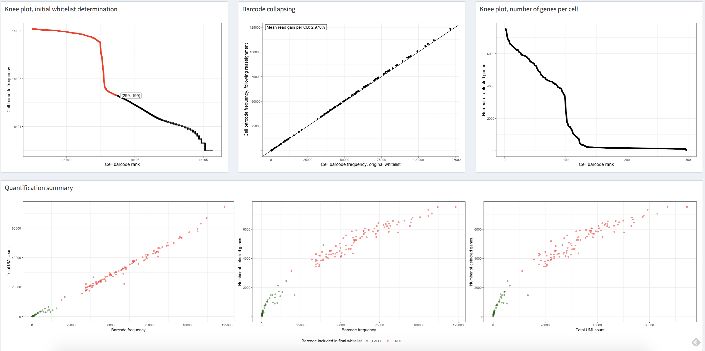

(raw-proc)=

# Raw data processing

Here, we discuss the fundamental aspects of "preprocessing" for single-cell and single-nucleus RNA-sequencing (sc/snRNA-seq) data. While "preprocessing" is a common terminology, it can be misleading.
The process involves critical decisions about handling and representing the data that directly impact subsequent analyses.
For clarity, we will refer to this phase of processing as "raw data processing", and our focus will be on the phase of data analysis that begins with lane-demultiplexed FASTQ files and ends with a count matrix.
This matrix represents the estimated number of distinct molecules derived from each gene per quantified cell, sometimes categorized by the inferred splicing status of each molecule ({numref}`raw-proc-fig-overview`).

:::{figure-md} raw-proc-fig-overview


An overview of the topics discussed in this chapter. In the plot, "txome" stands for transcriptome.
:::

The count matrix is the foundation for a wide range of scRNA-seq analyses {cite}`raw:Zappia2021`, including cell type identification or developmental trajectory inference.
A robust and accurate count matrix is essential for reliable {term}`downstream analyses`. Errors at this stage can lead to invalid conclusions and discoveries based on missed insights, or distorted signals in the data.
Despite the straightforward nature of the input (FASTQ files) and the desired output (count matrix), raw data processing presents several technical challenges, which are active areas of computational development.

In this section, we focus on key steps of raw data processing:

1. Read alignment/mapping
2. Cell barcode (CB) identification and correction
3. Estimation of molecule counts through {term}`unique molecular identifiers (UMIs)`

We also discuss the challenges and trade-offs involved in each step.

```{admonition} A note on preceding steps

The starting point for raw data processing is somewhat arbitrary. For this discussion, we treat lane-demultiplexed FASTQ files as the _raw_ input.
However, these files are derived from earlier steps, such as base calling and base quality estimation, which can influence downstream processing.
For example, base-calling errors and index hopping {cite}`farouni2020model` can introduce inaccuracies in FASTQ data.
These issues can be mitigated with computational approaches {cite}`farouni2020model` or experimental enhancements like [dual indexing](https://www.10xgenomics.com/blog/sequence-with-confidence-understand-index-hopping-and-how-to-resolve-it).

Here, we do not delve into the upstream processes, but consider the FASTQ files, derived from, e.g., BCL files via [appropriate tools](https://support.10xgenomics.com/single-cell-gene-expression/software/pipelines/latest/using/bcl2fastq-direct), as the raw input under consideration.
```

## Raw data quality control

After obtaining raw FASTQ files, it is important to evaluate the quality of the sequencing reads.
A quick and effective way to perform this is by using quality control (QC) tools like `FastQC`.
`FastQC` generates a detailed report for each FASTQ file, summarizing key metrics such as quality scores, base content, and other statistics that help identify potential issues arising from library preparation or sequencing.

While many modern single-cell data processing tools include some built-in quality checks—such as evaluating the N content of sequences or the fraction of mapped reads—it is still good practice to run an independent QC check.
This provides additional metrics that are often useful for identifying broader quality issues.

For readers interested in what a typical `FastQC` report looks like, in the following toggle content, example reports for both [high-quality](https://www.bioinformatics.babraham.ac.uk/projects/fastqc/good_sequence_short_fastqc.html) and [low-quality](https://www.bioinformatics.babraham.ac.uk/projects/fastqc/bad_sequence_fastqc.html) Illumina data provided by the `FastQC` [manual webpage](https://www.bioinformatics.babraham.ac.uk/projects/fastqc/), along with the tutorials and descriptions from [the RTSF at MSU](https://rtsf.natsci.msu.edu/genomics/technical-documents/fastqc-tutorial-and-faq.aspx), [the HBC training program](https://hbctraining.github.io/Intro-to-rnaseq-hpc-salmon/lessons/qc_fastqc_assessment.html), and [the QC Fail website](https://sequencing.qcfail.com/software/fastqc/) are used to demonstrate the modules in the `FastQC` report.
Although these tutorials are not explicitly made for single-cell data, many of the results are still relevant for single-cell data, with a few caveats described below.

In the toggle section, all graphs, except specifically mentioned, are taken from the example reports on the `FastQC` [manual webpage](https://www.bioinformatics.babraham.ac.uk/projects/fastqc/).

It is important to note that many QC metrics in FastQC reports are most meaningful only for biological reads—those derived from gene transcripts.
For single-cell datasets, such as 10x Chromium v2 and v3, this typically corresponds to read 2 (the files containing `R2` in their filename), which contain transcript-derived sequences.
In contrast, technical reads, which contain barcode and UMI sequences, often do not exhibit biologically typical sequence or GC content.
However, certain metrics, like the fraction of `N` base calls, are still relevant for all reads.

By running an initial quality check using tools like `FastQC`, researchers can identify potential problems early and ensure the raw data is suitable for subsequent processing and analysis.

```{dropdown} Example FastQC Reports and Tutorials

**0. Summary**

The summary panel on the left side of the HTML report displays the module names along with symbols that provide a quick assessment of the module results.
However, `FastQC` applies uniform thresholds across all sequencing platforms and biological materials.
As a result, warnings (orange exclamation marks) or failures (red crosses) may appear for high-quality data, while questionable data might receive passes (green ticks).
Therefore, each module should be carefully reviewed before drawing conclusions about data quality.

:::{figure-md} raw-proc-fig-fastqc-summary


The summary panel of a bad example.
:::

**1. Basic statistics**

The basic statistics module provides an overview of key information and statistics for the input FASTQ file, including the filename, total number of sequences, number of poor-quality sequences, sequence length, and the overall GC content (%GC) across all bases in all sequences.
High-quality single-cell data typically have very few poor-quality sequences and exhibit a uniform sequence length.
Additionally, the GC content should align with the expected GC content of the genome or transcriptome of the sequenced species.

:::{figure-md} raw-proc-fig-fastqc-basic-statistics


A good basic statistics report example.
:::

**2. Per base sequence quality**

The per-base sequence quality view displays a box-and-whisker plot for each position in the read, illustrating the range of quality scores across all bases at each position.
The x-axis represents the positions within the read, while the y-axis shows the quality scores.

For high-quality single-cell data, the yellow boxes—representing the interquartile range of quality scores—should fall within the green area (indicating good quality calls).
Similarly, the whiskers, which represent the 10th and 90th percentiles of the distribution, should also remain within the green area.
It is common to observe a gradual drop in quality scores along the length of the read, with some base calls at the last positions falling into the orange area (reasonable quality) due to a decreasing {term}`signal-to-noise ratio`, a characteristic of sequencing-by-synthesis methods.
However, the boxes should not extend into the red area (poor quality calls).

If poor-quality calls are observed, quality trimming may be necessary. [A more detailed explanation](https://hbctraining.github.io/Intro-to-rnaseq-hpc-salmon/lessons/qc_fastqc_assessment.html) of sequencing error profiles can be found in the [HBC training program](https://hbctraining.github.io/main/).

:::{figure-md} raw-proc-fig-fastqc-per-read-sequence-quality


A good (left) and a bad (right) per-read sequence quality graph.
:::

**3. Per tile sequence quality**

Using an Illumina library, the per-tile sequence quality plot highlights deviations from the average quality for reads across each {term}`flowcell` [tile](https://www.biostars.org/p/9461090/)(miniature imaging areas of the {term}`flowcell`).
The plot uses a color gradient to represent deviations, where “hotter” colors indicate larger deviations.
High-quality data typically display a uniform blue color across the plot, indicating consistent quality across all tiles of the flowcell.

If hot colors appear in certain areas, it suggests that only part of the flowcell experienced poor quality.
This could result from transient issues during sequencing, such as bubbles passing through the flowcell or smudges and debris within the flowcell lane.
For further investigation, consult resources like [QC Fail](https://sequencing.qcfail.com/articles/position-specific-failures-of-flowcells/) and the [common reasons for warnings](https://www.bioinformatics.babraham.ac.uk/projects/fastqc/Help/3%20Analysis%20Modules/12%20Per%20Tile%20Sequence%20Quality.html) provided in the `FastQC` manual.

:::{figure-md} raw-proc-fig-fastqc-per-tile-sequence-quality


A good (left) and a bad (right) per tile sequence quality view.
:::

**4. Per sequence quality scores**

The per-sequence quality score plot displays the distribution of average quality scores for each read in the file.
The x-axis represents the average quality scores, while the y-axis shows the frequency of each score.
For high-quality data, the plot should have a single peak near the high-quality end of the scale.
If additional peaks appear, it may indicate a subset of reads with quality issues.

:::{figure-md} raw-proc-fig-fastqc-per-sequence-quality-scores


A good (left) and a bad (right) per sequence quality score plot.
:::

**5. Per base sequence content**

The per-base sequence content plot shows the percentage of each nucleotide (A, T, G, and C) called at each base position across all reads in the file.
For single-cell data, it is common to observe fluctuations at the start of the reads.
This occurs because the initial bases represent the sequence of the priming sites, which are often not perfectly random.
This is a frequent occurrence in RNA-seq libraries, even though `FastQC` may flag it with a warning or failure, as noted on the [QC Fail website](https://sequencing.qcfail.com/articles/positional-sequence-bias-in-random-primed-libraries/).

:::{figure-md} raw-proc-fig-fastqc-per-base-sequence-content


A good (left) and bad (right) per base sequence content plot.
:::

**6. Per sequence GC content**

The per-sequence GC content plot displays the GC content distribution across all reads (in red) compared to a theoretical distribution (in blue).
The central peak of the observed distribution should align with the overall GC content of the transcriptome.
However, the observed distribution may appear wider or narrower than the theoretical one due to differences between the transcriptome's GC content and the genome's expected GC distribution.
Such variations are common and may trigger a warning or failure in `FastQC`, even if the data is acceptable.

A complex or irregular distribution in this plot, however, often indicates contamination in the library.
It is also important to note that interpreting GC content in transcriptomics can be challenging.
The expected GC distribution depends not only on the sequence composition of the transcriptome but also on gene expression levels in the sample, which are typically unknown beforehand.
As a result, some deviation from the theoretical distribution is not unusual in RNA-seq data.

:::{figure-md} raw-proc-fig-fastqc-per-sequence-gc-content


A good (left) and a bad (right) per sequence GC content plot.
The plot on the left is from [the RTSF at MSU](https://rtsf.natsci.msu.edu/genomics/technical-documents/fastqc-tutorial-and-faq.aspx).
The plot on the right is taken from [the HBC training program](https://hbctraining.github.io/Intro-to-rnaseq-hpc-salmon/lessons/qc_fastqc_assessment.html).
:::

**7. Per base N content**

The per-base N content plot displays the percentage of bases at each position that were called as ``N``, indicating that the sequencer lacked sufficient confidence to assign a specific nucleotide.
In a high-quality library, the ``N`` content should remain consistently at or near zero across the entire length of the reads.
Any noticeable non-zero ``N`` content may indicate issues with sequencing quality or library preparation.


:::{figure-md} raw-proc-fig-fastqc-per-base-n-content


A good (left) and a bad (right) per base N content plot.
:::

**8. Sequence length distribution**

The sequence length distribution graph displays the distribution of read lengths across all sequences in the file.
For most single-cell sequencing chemistries, all reads are expected to have the same length, resulting in a single peak in the graph.
However, if quality trimming was applied before the quality assessment, some variation in read lengths may be observed.
Small differences in read lengths due to trimming are normal and should not be a cause for concern if expected.

:::{figure-md} raw-proc-fig-fastqc-sequence-length-distribution


A good (left) and a bad (right) sequence length distribution plot.
:::

**9. Sequence duplication levels**

The sequence duplication level plot illustrates the distribution of duplication levels for read sequences, represented by the blue line, both before and after deduplication. In single-cell platforms, multiple rounds of {term}`PCR` are typically required, and highly expressed genes naturally produce a large number of transcripts.
Additionally, since `FastQC` is not UMI-aware (i.e., it does not account for unique molecular identifiers), it is common for a small subset of sequences to show high duplication levels.

While this may trigger a warning or failure in this module, it does not necessarily indicate a quality issue with the data.
However, the majority of sequences should still exhibit low duplication levels, reflecting a diverse and well-prepared library.

:::{figure-md} raw-proc-fig-fastqc-sequence-duplication-levels


A good (left) and a bad (right) per sequence duplication levels plot.
:::

**10. Overrepresented sequences**

The overrepresented sequences module identifies read sequences that constitute more than 0.1% of the total reads.
In single-cell sequencing, some overrepresented sequences may arise from highly expressed genes amplified during PCR.
However, the majority of sequences should not be overrepresented.

If the source of an overrepresented sequence is identified (i.e., not listed as "No Hit"), it could indicate potential contamination in the library from the corresponding source.
Such cases warrant further investigation to ensure data quality.

:::{figure-md} raw-proc-fig-fastqc-overrepresented-sequences


An overrepresented sequence table.
:::

**11. Adapter content**

The adapter content module displays the cumulative percentage of reads containing {term}`adapter sequences` at each base position.
High levels of adapter sequences indicate incomplete removal of adapters during library preparation, which can interfere with downstream analyses.
Ideally, no significant adapter content should be present in the data.
If adapter sequences are abundant, additional trimming may be necessary to improve data quality.

:::{figure-md} raw-proc-fig-fastqc-adapter-content


A good (left) and a bad (right) per sequence quality score plot. The plot on the right is from [the QC Fail website](https://sequencing.qcfail.com/articles/read-through-adapters-can-appear-at-the-ends-of-sequencing-reads/).
:::

```

Multiple FastQC reports can be combined into a single report using the tool [`MultiQC`](https://multiqc.info).

(raw-proc:aln-map)=

## Alignment and mapping

Mapping or Alignment is a critical step in single-cell raw data processing.
It involves determining the potential {term}`loci` of origin for each sequenced fragment, such as the genomic or transcriptomic locations that closely match the read sequence.
This step is essential for correctly assigning reads to their source regions.

In single-cell sequencing protocols, the raw sequence files typically include:

- Cell {term}`Barcodes` (CB): Unique identifiers for individual cells.
- Unique Molecular Identifiers (UMIs): Tags that distinguish individual molecules to account for amplification bias.
- Raw {term}`cDNA` Sequences: The actual read sequences generated from the molecules.

As the first step in raw data processing ({numref}`raw-proc-fig-overview`), accurate mapping or alignment is crucial for reliable downstream analyses.
Errors during this step, such as incorrect mapping of reads to transcripts or genes, can result in inaccurate or misleading count matrices, ultimately compromising the quality of subsequent analyses.

While mapping read sequences to reference sequences _far_ predates the development of scRNA-seq, the sheer scale of modern scRNA-seq datasets—often involving hundreds of millions to billions of reads—makes this step particularly computationally intensive.
Many existing RNA-seq aligners are protocol-agnostic and do not inherently account for features specific to scRNA-seq, such as cell barcodes, UMIs, or their positions and lengths.
As a result, additional tools are often required for steps like demultiplexing and UMI resolution {cite}`Smith2017`.

This reliance on separate tools introduces additional computational overhead.
It often necessitates storing large intermediate files, which significantly increases disk space usage.
Moreover, the extra input and output operations required to process these files further contribute to longer runtime requirements, making the mapping stage both resource-intensive and time-consuming.

To address the challenges of aligning and mapping scRNA-seq data, several specialized tools have been developed that handle the additional processing requirements automatically or internally.
These tools include:

- `Cell Ranger` (commercial software from 10x Genomics) {cite}`raw:Zheng2017`
- `zUMIs` {cite}`zumis`
- `alevin` {cite}`Srivastava2019`
- `RainDrop` {cite}`niebler2020raindrop`
- `kallisto|bustools` {cite}`Melsted2021`
- `STARsolo` {cite}`Kaminow2021`
- `alevin-fry` {cite}`raw:He2022`

These tools provide specialized capabilities for aligning scRNA-seq reads, parsing technical read content (e.g., cell barcodes and UMIs), demultiplexing, and UMI resolution.
Although they offer simplified user interfaces, their internal methodologies differ significantly.
Some tools generate traditional intermediate files, such as BAM files, which are processed further, while others operate entirely in memory or use compact intermediate representations to minimize input/output operations and reduce computational overhead.

While these tools vary in their specific algorithms, data structures, and trade-offs in time and space complexity, their approaches can generally be categorized along two axes:

1. **The type of mapping they perform**, and
2. **The type of reference sequence against which they map reads**.

(raw-proc:types-of-mapping)=

### Types of mapping

We focus on three main types of mapping algorithms commonly used for mapping sc/snRNA-seq data: spliced alignment, contiguous alignment, and variations of lightweight mapping.

First, we distinguish between alignment-based approaches and lightweight mapping-based approaches ({numref}`raw-proc-fig-alignment-mapping`).
Alignment-based methods use various heuristics to identify potential loci from which reads may originate and then score the best nucleotide-level alignment between the read and reference, typically using dynamic programming algorithms.
These algorithms have a long and rich history, with the specific algorithm used depending on the type of alignment required.

For example, [global alignment](https://en.wikipedia.org/wiki/Needleman%E2%80%93Wunsch_algorithm) aligns the entirety of the query and reference sequences, while [local alignment](https://en.wikipedia.org/wiki/Smith%E2%80%93Waterman_algorithm) focuses on aligning subsequences. Short-read alignment often employs a semi-global approach, also known as "fitting" alignment, where most of the query aligns to a substring of the reference.
Additionally, "soft-clipping" may be used to reduce penalties for mismatches, insertions, or deletions at the start or end of the read, achieved through ["extension" alignment](https://github.com/smarco/WFA2-lib#-33-alignment-span).
While these variations modify the rules of the dynamic programming recurrence and traceback, they do not fundamentally alter its overall complexity.

In addition to general alignment techniques, several sophisticated modifications and heuristics have been developed to enhance the practical efficiency of aligning genomic sequencing reads.
For example, `banded alignment` {cite}`chao1992aligning` is a popular heuristic used by many tools to avoid computing large portions of the dynamic programming table when alignment scores below a threshold are not of interest.
Other heuristics, like X-drop {cite}`zhang2000` and Z-drop {cite}`li2018minimap2`, efficiently prune unpromising alignments early in the process. Recent advances, such as wavefront alignment {cite}`marco2021fast`, marco2022optimal, enable the determination of optimal alignments in significantly reduced time and space, particularly when high-scoring alignments are present.
Additionally, much work has focused on optimizing data layout and computation to leverage instruction-level parallelism {cite}`wozniak1997using, rognes2000six, farrar2007striped`, and expressing dynamic programming recurrences in ways that facilitate data parallelism and vectorization, such as through difference encoding {cite:t}`Suzuki2018`.
Most widely-used alignment tools incorporate these highly optimized, vectorized implementations.

In addition to the alignment score, the {term}`backtrace` of the actual alignment that produces this score is often encoded as a `CIGAR` string (short for "Concise Idiosyncratic Gapped Alignment Report").
This alphanumeric representation is typically stored in the SAM or BAM file output.
For example, the `CIGAR` string `3M2D4M` indicates that the alignment has three matches or mismatches, followed by a deletion of length two (representing bases present in the reference but not the read), and then four more matches or mismatches.
Extended `CIGAR` strings can provide additional details, such as distinguishing between matches, mismatches, or insertions.
For instance, `3=2D2=2X` encodes the same alignment as the previous example but specifies that the three bases before the deletion are matches, followed by two matched bases and two mismatched bases after the deletion.
A detailed description of the `CIGAR` string format can be found in [the SAMtools manual](https://samtools.github.io/hts-specs/SAMv1.pdf) or [the SAM wiki page of UMICH](https://genome.sph.umich.edu/wiki/SAM#What_is_a_CIGAR.3F).

Alignment-based approaches, though computationally expensive, provide a quality score for each potential mapping of a read.
This score allows them to distinguish between high-quality alignments and low-complexity or "spurious" matches between the read and reference.
These approaches include traditional "full-alignment" methods, such as those implemented in tools like `STAR` {cite}`dobin2013star` and `STARsolo` {cite}`Kaminow2021`, as well as _selective-alignment_ methods, like those in `salmon` {cite}`Srivastava2020Alignment` and `alevin` {cite}`Srivastava2019`, which score mappings but skip the computation of the optimal alignment’s backtrace.

:::{figure-md} raw-proc-fig-alignment-mapping


An abstract overview of the alignment-based method and lightweight mapping-based method.
:::

Alignment-based approaches can be categorized into spliced-alignment and contiguous-alignment methods.
Currently, no lightweight-mapping approaches perform spliced mapping.

**Spliced-alignment methods** allow a sequence read to align across multiple distinct segments of a reference, allowing potentially large gaps between aligned regions.
These approaches are particularly useful for aligning RNA-seq reads to the genome, where reads may span {term}`splice junctions`.
In such cases, a contiguous sequence in the read may be separated by intron and exon subsequence in the reference, potentially spanning kilobases of sequence.
Spliced alignment is especially challenging when only a small portion of a read overlaps a splice junction, as limited sequence information is available to accurately place the overhanging segment.

**Contiguous-alignment methods**, in contrast, require a continuous substring of the reference to align well with the read.
While small insertions and deletions may be tolerated, large gaps—such as those in spliced alignments—are generally not allowed.

Alignment-based methods, such as spliced and contiguous alignment, can be distinguished from **lightweight-mapping methods**, which include approaches like **pseudoalignment** {cite}`Bray2016`, **quasi-mapping** {cite}`srivastava2016rapmap`, and **pseudoalignment with structural constraints** {cite}`raw:He2022`.

Lightweight-mapping methods achieve significantly higher speed by bypassing nucleotide-level alignment between the read and reference sequences.
Instead, they determine mapping loci based on alternative rules and heuristics, such as identifying matching k-mers or other exact matches.
These methods may also consider the orientation and relative positions of these matches on both the read and reference (e.g., through chaining).

While this approach greatly improves speed and throughput, it does not provide easily-interpretable score-based assessments to determine the quality of a match, making it more difficult to assess alignment confidence.

(raw-proc:mapping-references)=

### Mapping against different reference sequences

In addition to selecting a mapping algorithm, choices can _also_ be made regarding the reference sequence against which the reads are mapped.
There are three main categories of reference sequences:

- Full reference genome (typically annotated)
- Annotated transcriptome
- Augmented transcriptome

Currently, not all combinations of mapping algorithms and reference sequences are possible. For instance, lightweight-mapping algorithms do not yet support spliced mapping of reads against a reference genome.

(raw-proc:genome-mapping)=

#### Mapping to the full genome

The first type of reference used for mapping is the **entire genome** of the target organism, typically with annotated transcripts considered during mapping.
Tools such as `zUMIs` {cite}`zumis`, `Cell Ranger` {cite}`raw:Zheng2017`, and `STARsolo` {cite}`Kaminow2021` follow this approach.
Since many reads originate from **spliced transcripts**, this method requires a **splice-aware alignment algorithm** capable of splitting alignments across one or more splice junctions.

A key advantage of this approach is that it accounts for reads arising from any location in the genome, not just those from annotated transcripts.
Additionally, because a **genome-wide index** is constructed, there is minimal additional cost in reporting not only reads that map to known spliced transcripts but also those that overlap introns or align within non-coding regions, making this method equally effective for **single-cell** and **single-nucleus** data.
Another benefit is that even reads mapping outside annotated transcripts, exons, or introns can still be accounted for, enabling **_post hoc_ augmentation** of the quantified loci.
For instance, methods such as those described by {cite:t}`Pool2022` incorporate expressed {term}`UTR` extensions in a sample-specific, data-driven manner, potentially increasing gene detection and improving quantification sensitivity.

While spliced alignment against the full genome offers versatility, it also comes with certain trade-offs.
One major limitation is the high memory requirements of commonly used alignment tools in the single-cell space.
Many of these tools are based on the **STAR** aligner {cite}`dobin2013star`, due to its speed and versatillity, and require substantial computational resources.
For a human-scale genome, constructing and storing the index can demand over $32$ GB of memory.
Using a sparse [suffix array](https://en.wikipedia.org/wiki/Suffix_array) can nearly halve the final index size, but this comes at the cost of reduced alignment speed and still requires significant memory for initial construction.

Additionally, spliced alignment is inherently more complex than contiguous alignment.
Because current spliced-alignment tools must explicitly compute a score for each read, this approach has a higher computational cost compared to alternatives.

Finally, spliced alignment requires an available reference genome for the organism under study.
While this is rarely an issue for well-characterized model organisms, it can pose challenges when working with non-model organisms, where only a transcriptome assembly may be available.

(raw-proc:txome-mapping)=

#### Mapping to the spliced transcriptome

To reduce the computational overhead of spliced alignment to a genome, a widely adopted alternative is to use only the annotated transcript sequences as the reference.
Since most single-cell experiments are conducted on model organisms like mouse or human, which have well-annotated transcriptomes, transcriptome-based quantification can achieve similar read coverage to genome-based methods.

Compared to the genome, transcriptome sequences are much smaller, significantly reducing the computational resources needed for mapping.
Additionally, because splicing patterns are already represented in transcript sequences, this approach eliminates the need for complex spliced alignment.
Instead, one can simply search for contiguous alignments or mappings for the read.
Alternatively, reads can be mapped using contiguous alignments, making both alignment-based and lightweight-mapping techniques suitable for transcriptome references.
As a result, both approaches are commonly used in popular tools that perform reference mapping against the spliced transcriptome.

While these approaches significantly reduce the memory and time required for alignment and mapping, they fail to capture reads that arise from outside the spliced transcriptome.
As a result, they are not suitable for processing single-nucleus data.
Even in single-cell experiments, reads arising from outside of the spliced transcriptome can constitute a substantial fraction of all data, and there is growing evidence that such reads should be incorporated into subsequent analysis {cite}`technote_10x_intronic_reads,Pool2022`.
Even in single-cell experiments, a substantial fraction of reads may arise from regions outside the spliced transcriptome, and increasing evidence suggests that incorporating these reads into downstream analyses can be beneficial {cite}`technote_10x_intronic_reads,Pool2022`.
Additionally, when paired with lightweight-mapping methods, short sequences shared between the spliced transcriptome and the actual genomic regions that generated a read can lead to spurious mappings. This, in turn, may result in misleading and even biologically implausible gene expression estimates {cite}`Kaminow2021,Bruning2022Comparative,raw:He2022`.

(raw-proc:aug-txome-mapping)=

#### Mapping to an augmented transcriptome

To account for reads originating outside spliced transcripts, the spliced transcript sequences can be augmented with additional reference sequences, such as full-length unspliced transcripts or excised intronic sequences.
By incorporating these elements, augmented transcriptome references maintain a smaller index than the full genome while still allowing for contiguous read alignments.
This enables faster and more memory-efficient mapping compared to full-genome alignment, while still capturing many reads that would otherwise be missed when mapping solely to the spliced transcriptome.

Additionally, expanding the reference set improves mapping accuracy.
More reads can be confidently assigned compared to using only the spliced transcriptome, and when combined with lightweight mapping approaches, spurious mappings can be significantly reduced {cite}`raw:He2022`.
Augmented transcriptomes are widely used in methods that do not map to the full genome, particularly for single-nucleus data processing and RNA velocity analysis {cite}`Soneson2021Preprocessing` (see {doc}`../trajectories/rna_velocity`).
These augmented references can be constructed for all common methods that do not rely on spliced alignment to the full genome {cite}`Srivastava2019,Melsted2021,raw:He2022`.

{cite:t}`raw:He2022` argue that this approach is valuable even for standard single-cell RNA-seq data and recommend constructing an augmented _splici_ reference (spliced + intronic) for mapping and quantification.
The _splici_ reference is built using the spliced transcriptome sequence alongside sequences representing the merged intronic intervals of annotated genes.
Each reference sequence is labeled with its splicing status, and mapping results are processed using splicing status-aware methods for {ref}`raw-proc:umi-resolution`.

This approach offers several key benefits.
It allows the use of lightweight mapping methods while significantly reducing spurious mappings.
Additionally, it enables the detection of both spliced and unspliced reads, improving sensitivity in downstream analyses {cite}`technote_10x_intronic_reads,Pool2022`.
Since splicing status is tracked and reported separately, this method also unifies the preprocessing pipeline across single-cell, single-nucleus, and RNA velocity analyses, making it a versatile solution for transcript quantification.

(raw-proc:cb-correction)=

## Cell barcode correction

Droplet-based single-cell segregation systems, such as those provided by 10x Genomics, have become an important tool for studying the cause and consequences of cellular heterogeneity.
In this segregation system, the RNA material of each captured cell is extracted within a water-based droplet encapsulation along with a **barcoded bead**.
These beads tag the RNA content of individual cells with unique oligonucleotides, called cell barcodes (CBs), that are later sequenced along with the fragments of the cDNAs that are reversely transcribed from the RNA content.
The beads contain high-diversity DNA barcodes, allowing for parallel barcoding of a cell’s molecular content and _in silico_ demultiplexing of sequencing reads into individual cellular bins.

```{admonition} A note on alignment orientation

Depending on the sample chemistry and user-defined processing options, not all sequenced fragments that align to the reference are necessarily considered for quantification and barcode correction.
One commonly-applied criterion for filtering is alignment orientation.
Specifically, certain chemistries specify protocols such that the aligned reads should only derive from (i.e. map back to) the underlying transcripts in a specific orientation.
For example, in 10x Genomics 3' Chromium chemistries, we expect the biological read to align to the underlying transcript's forward strand, though anti-sense reads do exist {cite}`technote_10x_intronic_reads`.
As a result, reads mapped in the reverse-complement orientation to the reference sequences may be ignored or filtered out based on user-defined settings.
If a chemistry follows such a so-called "stranded" protocol, this should be documented.
```

### Type of errors in barcoding

The tag, sequence, and demultiplexing method used for single-cell profiling is generally effective.
However, in droplet-based libraries, the number of observed cell barcodes (CBs) can differ significantly—often by several fold—from the number of originally encapsulated cells.
This discrepancy arises from several key sources of error:

- Doublets/multiplets: A single barcode may be associated with multiple cells, leading to an undercounting of cells.
- Empty droplets: Some droplets contain no encapsulated cells, and ambient RNA can become tagged with a barcode and sequenced, resulting in overcounting of cells.
- Sequence errors: Errors introduced during PCR amplification or sequencing can distort barcode counts, contributing to both under- and over-counting.

To address these issues, computational tools for demultiplexing RNA-seq reads into cell-specific bins use various diagnostic indicators to filter out artefactual or low-quality data.
Numerous methods exist for removing ambient RNA contamination {cite}`raw:Young2020,Muskovic2021,Lun2019`, detecting doublets {cite}`DePasquale2019,McGinnis2019,Wolock2019,Bais2019`, and correcting cell barcode errors based on nucleotide sequence similarity.

Several common strategies are used for cell barcode identification and correction.

1. **Correction against a known list of _potential_ barcodes**:
   Certain chemistries, such as 10x Chromium, draw CBs from a known pool of potential barcode sequences.
   Thus, the set of barcodes observed in any sample is expected to be a subset of this known list, often called a "whitelist", "permit list", or "pass list".
   In this case, the standard approach assumes that:

- Any barcode matching an entry in the known list is correct.
- Any barcode not in the list is corrected by finding the closest match from the permit list, typically using {term}`Hamming distance` or {term}`edit distance`.
  This strategy allows for efficient barcode correction but has limitations.
  If a corrupted barcode closely resembles multiple barcodes in the permit list, its correction becomes ambiguous.
  For example, for a barcode taken from the [10x Chromium v3 permit list](https://teichlab.github.io/scg_lib_structs/data/10X-Genomics/3M-february-2018.txt.gz) and mutated at a single position to a barcode not in the list, there is an $\sim 81\%$ probability that it sits at hamming distance $1$ from two or more barcodes in the permit list.
  The probability of such collisions can be reduced by considering correcting _only_ against barcodes from the known permit list, which, themselves, occur exactly in the given sample (or even only those that occur exactly in the given sample above some nominal frequency threshold).
  Also, information such as the base quality at the "corrected" position can be used to potentially break ties in the case of ambiguous corrections.
  Yet, as the number of assayed cells increases, insufficient sequence diversity in the set of potential cell barcodes increases the frequency of ambiguous corrections, and reads tagged with barcodes having ambiguous corrections are most commonly discarded.

2. **Knee or elbow-based methods**:
   If a set of potential barcodes is unknown — or even if it is known, but one wishes to correct directly from the observed data itself without consulting an external list — one can use a method based on the observation that high-quality barcodes are those associated with the highest number of reads in the sample.
   To achieve this, one can construct a cumulative frequency plot where barcodes are sorted in descending order based on the number of distinct reads or UMIs they are associated with.
   Often, this ranked cumulative frequency plot will contain a "knee" or "elbow" – an inflection point that can be used to characterize frequently occurring barcodes from infrequent (and therefore likely erroneous) barcodes.
   Many methods exist for attempting to identify such an inflection point {cite}`Smith2017,Lun2019,raw:He2022` as a likely point of discrimination between properly captured cells and empty droplets.
   Subsequently, the set of barcodes that appear "above" the knee can be treated as a permit list against which the rest of the barcodes may be corrected, as in the first method list above.
   Such an approach is flexible as it can be applied in chemistries that have an external permit list and those that don't.
   Further parameters of the knee-finding algorithms can be altered to yield more or less restrictive selected barcode sets.
   Yet, such an approach can have certain drawbacks, like a tendency to be overly conservative and sometimes failing to work robustly in samples where no clear knee is present.

3. **Filtering and correction based on an expected cell count**:
   When barcode frequency distributions lack a clear knee or show bimodal patterns due to technical artifacts, barcode correction can be guided by a user-provided expected cell count.
   In such an approach, the user provides an estimate of the expected number of assayed cells.
   Then, the barcodes are ordered by descending frequency, the frequency $f$ at a robust quantile index near the expected cell count is obtained, and all cells having a frequency within a small constant fraction of $f$ (e.g., $\ge \frac{f}{10}$) are considered as valid barcodes.
   Again, the remaining barcodes are corrected against this valid list by attempting to correct uniquely to one of these valid barcodes based on sequence similarity.

4. **Filtering based on a forced number of valid cells**:
   The simplest approach, although potentially problematic, is for the user to manually specify the number of valid barcodes.

- The user chooses an index in the sorted barcode frequency list.
- All barcodes above this threshold are considered valid.
- Remaining barcodes are corrected against this list using standard similarity-based correction methods.
  While this guarantees selection of at least n cells, it assumes that the chosen threshold accurately reflects the number of real cells.
  It is only reasonable if the user has a good reason to believe that the threshold frequency should be set around the provided index.

%In the `alevin-fry` framework, the frequency of every observed cell barcode is generated, and there are four customizable options to select the high-quality cell barcodes for downstream analysis:

### Future challenges

While cellular barcoding of high-throughput single-cell profiling has been a tremendously successful approach, some challenges still remain, especially as the scale of experiments continues to grow.
For example, the design of a robust method for selecting high-quality cell barcodes from the set of all the observations is still an active area of research, with distinct challenges arising, e.g., between single-cell and single-nucleus experiments.
Also, as single-cell technologies have advanced to profile increasing numbers of cells, insufficient sequence diversity in the CB sequence can result in sequence corrections leading to CB collision.
Addressing this latter problem may require more intelligent barcode design methods and continuing increases in the lengths of oligonucleotides used for cell barcoding.

(raw-proc:umi-resolution)=

## UMI resolution

After cell barcode (CB) correction, reads have either been discarded or assigned to a corrected CB.
Subsequently, we wish to quantify the abundance of each gene within each corrected CB.

Because of the amplification bias as discussed in {ref}`exp-data:transcript-quantification`, reads must be deduplicated, based upon their UMI, to assess the true count of sampled molecules.
Additionally, several other complicating factors present challenges when attempting to perform this estimation.

The UMI deduplication step aims to identify the set of reads and UMIs derived from each original, pre-PCR molecule in each cell captured and sequenced in the experiment.
The result of this process is to allocate a molecule count to each gene in each cell, which is subsequently used in the downstream analysis as the raw expression estimate for this gene.
We refer to this process of looking at the collection of observed UMIs and their associated mapped reads and attempting to infer the original number of observed molecules arising from each gene as the process of _UMI resolution_.

To simplify the explanation, reads that map to a reference (e.g., a genomic locus of a gene) are referred to as the reads of that reference, and their UMI tags are called the UMIs of that reference.
The set of reads associated with a specific UMI is referred to as the reads of that UMI.

A read can be tagged by only one UMI but may belong to multiple references if it maps to more than one.
Additionally, since molecule barcoding in scRNA-seq is typically isolated and independent for each cell (aside from the previously discussed challenges in resolving cell barcodes), _UMI resolution_ will be explained for a single cell without loss of generality.
This same procedure is generally applied to all cells independently.

(raw-proc:need-for-umi-resolution)=

### The need for UMI resolution

In the ideal case, where the correct (unaltered) UMIs tag reads, the reads of each UMI uniquely map to a common reference gene, and there is a bijection between UMIs and pre-PCR molecules.
Consequently, the UMI deduplication procedure is conceptually straightforward: the reads of a UMI are the PCR duplicates from a single pre-PCR molecule.
The number of captured and sequenced molecules of each gene is the number of distinct UMIs observed for this gene.

However, the problems encountered in practice make the simple rules described above insufficient for identifying the gene origin of UMIs in general and necessitate the development of more sophisticated models.
Here, we concern ourselves primarily with two challenges.

- **Errors in UMIs**:
  These occur when the sequenced UMI tag of reads contains errors introduced during PCR or the sequencing process.
  Common UMI errors include nucleotide substitutions during PCR and read errors during sequencing.
  Failing to address such UMI errors can inflate the estimated number of molecules {cite}`Smith2017,ziegenhain2022molecular`.

- **Multimapping**:
  This issue arises in cases where a read or UMI belongs to multiple references (e.g., multi-gene reads/UMIs). This happens when different reads of a UMI map to different genes, when a read maps to multiple genes, or both.
  The consequence of this issue is that the gene origin of the multi-gene reads/UMIs is ambiguous, which results in uncertainty about the sampled pre-PCR molecule count of those genes.
  Simply discarding multi-gene reads/UMIs can lead to a loss of data or a biased estimate among genes that tend to produce multimapping reads, such as sequence-similar gene families {cite}`Srivastava2019`.

```{admonition} A Note on UMI Errors
UMI errors, especially those due to nucleotide substitutions and miscallings, are prevalent in single-cell experiments.
{cite:t}`Smith2017` establish that the average number of bases different (edit distance) between the observed UMI sequences in the tested single-cell experiments is lower than randomly sampled UMI sequences, and the enrichment of low edit distances is well correlated with the degree of PCR amplification.
Multimapping also exists in single-cell data and, depending upon the gene being considered, can occur at a non-trivial rate.
{cite:t}`Srivastava2019` show that discarding the multimapping reads can negatively bias the predicted molecule counts.
```

There exist other challenges that we do not focus upon here, such as "convergent" and "divergent" UMI collisions.
We consider the case where the same UMI is used to tag two different pre-PCR molecules arising from the same gene, in the same cell, as a convergent collision.
When two or more distinct UMIs arise from the same pre-PCR molecule, e.g., due to the sampling of multiple priming sites from this molecule, we consider this a divergent collision.
We expect convergent UMI collisions to be rare and, therefore, their effect typically small.
Further, transcript-level mapping information can sometimes be used to resolve such collisions {cite}`Srivastava2019`.
Divergent UMI collisions occur primarily among introns of unspliced transcripts {cite}`technote_10x_intronic_reads`, and approaches to addressing the issues they raise are an area of active research {cite}`technote_10x_intronic_reads,Gorin2021`.

Given that the use of UMIs is near ubiquitous in high-throughput scRNA-seq protocols and the fact that addressing these errors improves the estimation of gene abundances, there has been much attention paid to the problem of UMI resolution in recent literature {cite}`Islam2013,Bose2015,raw:Macosko2015,Smith2017,Srivastava2019,Kaminow2021,Melsted2021,raw:He2022,calib,umic,zumis`.

(raw-proc:graph-based-umi-resolution)=

### Graph-based UMI resolution

As a result of the problems that arise when attempting to resolve UMIs, many methods have been developed to address the problem of UMI resolution.
While there are a host of different approaches for UMI resolution, we will focus on a framework for representing problem instances, modified from a framework initially proposed by {cite:t}`Smith2017`, that relies upon the notion of a _UMI graph_.
Each connected component of this graph represents a sub-problem wherein certain subsets of UMIs are collapsed (i.e., resolved as evidence of the same pre-PCR molecule).
Many popular UMI resolution approaches can be interpreted in this framework by simply modifying precisely how the graph is refined and how the collapse or resolution procedure carried out over this graph works.

In the context of single-cell data, a UMI graph $G(V,E)$ is a {term}`directed graph` with a node set $V$ and an edge set $E$.
Each node $v_i \in V$ represents an equivalence class (EC) of reads, and the edge set $E$ encodes the relationship between the ECs.
The equivalence relation $\sim_r$ defined on reads is based on their UMI and mapping information.
We say reads $r_x$ and $r_y$ are equivalent, $r_x \sim_r r_y$, if and only if they have identical UMI tags and map to the same set of references.
UMI resolution approaches may define a "reference" as a genomic locus {cite}`Smith2017`, transcript {cite}`Srivastava2019,raw:He2022` or gene {cite}`raw:Zheng2017,Kaminow2021`.
Other UMI resolution approaches exist, for example, the reference-free model {cite}`umic` and the method of moments {cite}`Melsted2021`, but they may not be easily represented in this framework and are not discussed in further detail here.

In the UMI graph framework, a UMI resolution approach can be divided into three major steps:
**defining nodes**, **defining adjacency relationships**, and **resolving components**.
Each of these steps has different options that can be modularly composed by different approaches.
Additionally, these steps may sometimes be preceded (and/or followed) by filtering steps designed to discard or heuristically assign (by modifying the set of reference mappings reported) reads and UMIs exhibiting certain types of mapping ambiguity.

(raw-proc:umi-graph-node-def)=

#### Defining nodes

As described above, a node $v_i \in V$ is an equivalence class of reads.
Therefore, $V$ can be defined based on the full or filtered set of mapped reads and their associated _uncorrected_ UMIs.
All reads that satisfy the equivalence relation $\sim_r$ based on their reference set and UMI tag are associated with the same vertex $v \in V$.
An EC is a multi-gene EC if its UMI is a multi-gene UMI.
Some approaches will avoid the creation of such ECs by filtering or heuristically assigning reads prior to node creation, while other approaches will retain and process these ambiguous vertices and attempt and resolve their gene origin via parsimony, probabilistic assignment, or based on a related rule or model {cite}`Srivastava2019,Kaminow2021,raw:He2022`.

(raw-proc:umi-graph-edge-def)=

#### Defining the adjacency relationship

After creating the node set $V$ of a UMI graph, the adjacency of nodes in $V$ is defined based on the distance, typically the Hamming or edit distance, between their UMI sequences and, optionally, the content of their associated reference sets.

Here we define the following functions on the node $v_i \in V$:

- $u(v_i)$ is the UMI tag of $v_i$.
- $c(v_i) = |v_i|$ is the cardinality of $v_i$, i.e., the number of reads associated with $v_i$ that are equivalent under $\sim_r$.
- $m(v_i)$ is the reference set encoded in the mapping information, for $v_i$.
- $D(v_i, v_j)$ is the distance between $u(v_i)$ and $u(v_j)$, where $v_j \in V$.

Given these function definitions, any two nodes $v_i, v_j \in V$ will be incident with a bi-directed edge if and only if $m(v_i) \cap m(v_j) \ne \emptyset$ and $D(v_i,v_j) \le \theta$, where $\theta$ is a distance threshold and is often set as $\theta=1$ {cite}`Smith2017,Kaminow2021,Srivastava2019`.
Additionally, the bi-directed edge might be replaced by a directed edge incident from $v_i$ to $v_j$ if $c(v_i) \ge 2c(v_j) -1$ or vice versa {cite}`Smith2017,Srivastava2019`.
Though these edge definitions are among the most common, others are possible, so long as they are completely defined by the $u$, $c$, $m$, and $D$ functions. With $V$ and $E$ in hand, the UMI graph $G = (V,E)$ is now defined.

(raw-proc:umi-graph-resolution-def)=

#### Defining the graph resolution approach

Given the defined UMI graph, many different resolution approaches may be applied.
A resolution method may be as simple as finding the set of connected components, clustering the graph, greedily collapsing nodes or contracting edges {cite}`Smith2017`, or searching for a cover of the graph by structures following certain rules (e.g., monochromatic arboresences {cite}`Srivastava2019`) to reduce the graph.
As a result, each node in the reduced UMI graph, or each element in the cover in the case that the graph is not modified dynamically, represents a pre-PCR molecule.
The collapsed nodes or covering sets are regarded as the PCR duplicates of that molecule.

Different rules for defining the adjacency relationship and different approaches for graph resolution itself can seek to preserve different properties and can define a wide variety of distinct overall UMI resolution approaches.
For approaches that probabilistically resolve ambiguity caused by multimapping, the resolved UMI graph may contain multi-gene equivalence classes (ECs), with their gene origins determined in the next step.

(raw-proc:umi-graph-quantification)=

#### Quantification

The last step in UMI resolution is quantifying the abundance of each gene using the resolved UMI graph.
For approaches that discard multi-gene ECs, the molecule count vector for the genes in the current cell being processed (or count vector for short) is generated by counting the number of ECs labeled with each gene.
On the other hand, approaches that process, rather than discard, multi-gene ECs usually resolve the ambiguity by applying some statistical inference procedure.
For example, {cite:t}`Srivastava2019` introduce an expectation-maximization (EM) approach for probabilistically assigning multi-gene UMIs, and related EM algorithms have also been introduced as optional steps in subsequent tools {cite}`Melsted2021,Kaminow2021,raw:He2022`.
In this model, the collapsed-EC-to-gene assignments are latent variables, and the deduplicated molecule count of genes are the main parameters.
Intuitively, evidence from gene-unique ECs will be used to help probabilistically apportion the multi-gene ECs.
The EM algorithm seeks the parameters that together have the (locally) highest likelihood of generating the observed ECs.

Usually, the UMI resolution and quantification process described above will be performed separately for each cell, represented by a corrected CB, to create a complete count matrix for all genes in all cells.
However, the relative paucity of per-cell information in high-throughput single-cell samples limits the evidence available when performing UMI resolution, which in turn limits the potential efficacy of model-based solutions like the statistical inference procedure described above.
Thus, further research here is certainly warranted.
For example, {cite:t}`Srivastava2020-lf` introduced an approach that allows sharing information among transcriptionally similar cells to improve the quantification result further.

(raw-proc:count-qc)=

## Count matrix quality control

Once a count matrix has been generated, it is important to perform a quality control (QC) assessment.
There are several distinct assessments that generally fall under the rubric of quality control.
Basic global metrics are often recorded and reported to help assess the overall quality of the sequencing measurement itself.
These metrics consist of quantities such as the total fraction of mapped reads, the distribution of distinct UMIs observed per cell, the distribution of UMI deduplication rates, the distribution of detected genes per cell, etc.
These and similar metrics are often recorded by the quantification tools themselves {cite}`raw:Zheng2017,Kaminow2021,Melsted2021,raw:He2022` since they arise naturally and can be computed during the process of read mapping, cell barcode correction, and UMI resolution.
Likewise, there exist several tools to help organize and visualize these basic metrics, such as the [Loupe browser](https://support.10xgenomics.com/single-cell-gene-expression/software/visualization/latest/what-is-loupe-cell-browser), [alevinQC](https://github.com/csoneson/alevinQC), or a [kb_python report](https://github.com/pachterlab/kb_python), depending upon the quantification pipeline being used.
Beyond these basic global metrics, at this stage of analysis, QC metrics are designed primarily to help determine which cells (CBs) have been sequenced "successfully", and which exhibit artifacts that warrant filtering or correction.

In the following toggle section, we discuss an example alevinQC report taken from the `alevinQC` [manual webpage](https://github.com/csoneson/alevinQC).

```{toggle}

Once `alevin` or `alevin-fry` quantifies the single-cell data, the quality of the data can be assessed through the R package [`alevinQC`](https://github.com/csoneson/alevinQC).
The alevinQC report can be generated in PDF format or as R/Shiny applications, which summarizes various components of the single-cell library, such as reads, CBs, and UMIs.

**1. Metadata and summary tables**

:::{figure-md} raw-proc-fig-alevinqc-summary


An example of the summary section of an alevinQC report.
:::

The first section of an alevinQC report shows a summary of the input files and the processing result, among which, the top left table displays the metadata provided by `alevin` (or `alevin-fry`) for the quantification results.
For example, this includes the time of the run, the version of the tool, and the path to the input FASTQ and index files.
The top right summary table provides the summary statistics for various components of the single-cell library, for example, the number of sequencing reads, the number of selected cell barcodes at various levels of filtering, and the total number of deduplicated UMIs.

**2. Knee plot, initial whitelist determination**

:::{figure-md} raw-proc-fig-alevinqc-plots


The figure shows the plots in the alevinQC report of an example single-cell dataset, of which the cells are filtered using the "knee" finding method.
Each dot represents a corrected cell barcode with its corrected profile.
:::

The first (top left) view in {numref}`raw-proc-fig-alevinqc-plots` shows the distribution of cell barcode frequency in decreasing order.
In all plots shown above, each point represents a corrected cell barcode, with its x-coordinate corresponding to its cell barcode frequency rank.
In the top left plot, the y-coordinate corresponds to the observed frequency of the corrected barcode.
Generally, this plot shows a "knee"-like pattern, which can be used to identify the initial list of high-quality barcodes.
The red dots in the plot represent the cell barcodes selected as the high-quality cell barcodes in the case that "knee"-based filtering was applied.
In other words, these cell barcodes contain a sufficient number of reads to be deemed high-quality and likely derived from truly present cells.
Suppose an external permit list is passed in the CB correction step, which implies no internal algorithm was used to distinguish high-quality cell barcodes.
In that case, all dots in the plot will be colored red, as all these corrected cell barcodes are processed throughout the raw data processing pipeline and reported in the gene count matrix.
One should be skeptical of the data quality if the frequency is consistently low across all cell barcodes.

**3. Barcode collapsing**

After identification of the barcodes that will be processed, either through an internal threshold (e.g., from the "knee"-based method) or through external whitelisting, `alevin` (or `alevin-fry`) performs cell barcode sequence correction.
The barcode collapsing plot, the upper middle plot in the {numref}`raw-proc-fig-alevinqc-plots`, shows the number of reads assigned to a cell barcode after sequence correction of the cell barcodes versus prior to correction.
Generally, we would see that all points fall close to the line representing $x = y$, which means that the reassignments in CB correction usually do not drastically change the profile of the cell barcodes.

**4. Knee Plot, number of genes per cell**

The upper right plot in {numref}`raw-proc-fig-alevinqc-plots` shows the distribution of the number of observed genes of all processed cell barcodes.
Generally, a mean of $2,000$ genes per cell is considered modest but reasonable for the downstream analyses.
One should double-check the quality of the data if all cells have a low number of observed genes.

**5. Quantification summary**

Finally, a series of quantification summary plots, the bottom plots in {numref}`raw-proc-fig-alevinqc-plots`, compare the cell barcode frequency, the total number of UMIs after deduplication and the total number of non-zero genes using scatter plots.
In general, in each plot, the plotted data should demonstrate a positive correlation, and, if high-quality filtering (e.g., knee filtering) has been performed, the high-quality cell barcodes should be well separated from the rest.
Moreover, one should expect all three plots to convey similar trends.
If using an external permit list, all the dots in the plots will be colored red, as all these cell barcodes are processed and reported in the gene count matrix.
Still, we should see the correlation between the plots and the separation of the dots representing high-quality cells to others.
If all of these metrics are consistently low across cells or if these plots convey substantially different trends, then one should be concerned about the data quality.

```

### Empty droplet detection

One of the first QC steps is determining which cell barcodes correspond to "high-confidence" sequenced cells.
It is common in droplet-based protocols {cite}`raw:Macosko2015` that certain barcodes are associated with ambient {term}`RNA` instead of the RNA of a captured cell.
This happens when droplets fail to capture a cell.
These empty droplets still tend to produce sequenced reads, although the characteristics of these reads look markedly different from those associated with barcodes corresponding to properly captured cells.
Many approaches exist to assess whether a barcode likely corresponds to an empty droplet or not.
One simple method is to examine the cumulative frequency plot of the barcodes, in which barcodes are sorted in descending order of the number of distinct UMIs with which they are associated.
This plot often contains a "knee" that can be identified as a likely point of discrimination between properly captured cells and empty droplets {cite}`Smith2017,raw:He2022`.
While this "knee" method is intuitive and can often estimate a reasonable threshold, it has several drawbacks.
For example, not all cumulative histograms display an obvious knee, and it is notoriously difficult to design algorithms that can robustly and automatically detect such knees.
Finally, the total UMI count associated with a barcode may not, alone, be the best signal to determine if the barcode was associated with an empty or damaged cell.

This led to the development of several tools specifically designed to detect empty or damaged droplets, or cells generally deemed to be of "low quality" {cite}`Lun2019,Heiser2021,Hippen2021,Muskovic2021,Alvarez2020,raw:Young2020`.
These tools incorporate a variety of different measures of cell quality, including the frequencies of distinct UMIs, the number of detected genes, and the fraction of mitochondrial RNA, and typically work by applying a statistical model to these features to classify high-quality cells from putative empty droplets or damaged cells.
This means that cells can typically be scored, and a final filtering can be selected based on an estimated posterior probability that cells are not empty or compromised.
While these models generally work well for single-cell {term}`RNA`-seq data, one may have to apply several additional filters or heuristics to obtain robust filtering in single-nucleus {term}`RNA`-seq data {cite}`Kaminow2021,raw:He2022`, like those exposed in the [`emptyDropsCellRanger`](https://github.com/MarioniLab/DropletUtils/blob/master/R/emptyDropsCellRanger.R) function of `DropletUtils` {cite}`Lun2019`.

### Doublet detection

In addition to determining which cell barcodes correspond to empty droplets or damaged cells, one may also wish to identify those cell barcodes that correspond to doublets or multiplets.
When a given droplet captures two (doublets) or more (multiplets) cells, this can result in a skewed distribution for these cell barcodes in terms of quantities like the number of reads and UMIs they represent, as well as gene expression profiles they display.
Many tools have also been developed to predict the doublet status of cell barcodes {cite}`DePasquale2019,McGinnis2019,Wolock2019,Bais2019,Bernstein2020`.
Once detected, cells determined to likely be doublets and multiplets can be removed or otherwise adjusted for in the subsequent analysis.

(raw-proc:output-representation)=

## Count data representation

As one completes initial raw data processing and quality control and moves on to subsequent analyses, it is important to acknowledge and remember that the cell-by-gene count matrix is, at best, an approximation of the sequenced molecules in the original sample.
At several stages of the raw data processing pipeline, heuristics are applied, and simplifications are made to enable the generation of this count matrix.
For example, read mapping is imperfect, as is cell barcode correction.
Accurately resolving UMIs is particularly challenging, and issues related to UMIs attached to multimapping reads are often overlooked.
Additionally, multiple priming sites, especially in unspliced molecules, can violate the commonly assumed one molecule-to-one UMI relationship.

In light of these challenges and the simplifications adopted to address them, there remains active research as to how best to represent the preprocessed data to downstream tools.
For example, several quantification tools {cite}`Srivastava2019,Melsted2021,Kaminow2021,raw:He2022` implement an _optional_ EM algorithm, initially introduced in this context by {cite:t}`Srivastava2019`, that probabilistically apportions UMIs associated with reads that map to more than one gene.
This, however, can result in non-integer count matrices that may be unexpected by certain downstream tools.
Alternatively, UMIs can be resolved to _gene groups_ instead of individual genes, preserving multimapping information in the preprocessed output.
Notably, a similar approach has been used at the transcript level for over a decade as a succinct internal representation in bulk RNA-seq transcript quantification tools {cite}`Turro2011,Nicolae2011,Patro2014,Bray2016,Patro2017,Ju2017`.
Additionally, transcript-level representations have been proposed for clustering and dimensionality reduction in full-length single-cell RNA-seq data {cite}`Ntranos2016` and for differential expression analysis in single-cell RNA-seq {cite}`Ntranos2019`.
In this case, instead of the resulting count matrix having dimensions $C \times G$, where $G$ is the number of genes in the quantified annotation, it will have dimension $C \times E$, where $E$ is the number of distinct _gene groups_ (commonly called equivalence class labels) across all cells in the given sample.
By propagating this information to the output count matrix, one can avoid the application of heuristic or probabilistic UMI resolution methods that can result in loss of data, or bias, in the counts used in downstream analyses.
Of course, to make use of this information, downstream analysis methods must expect the information in this format.
Further, those downstream methods must typically have a way to resolve these counts, eventually, to the level of genes, as the abundance of _gene groups_ lacks the intuitive biological interpretability of gene abundance.
Nonetheless, the benefits provided by such representations, in terms of conveying more complete and accurate information to downstream analysis tools, can be substantial, and tools taking advantage of such representations are being developed (e.g. [DifferentialRegulation](https://github.com/SimoneTiberi/DifferentialRegulation)); this is still an active area of research.

## Brief discussion

To close this chapter, we convey some observations and suggestions that have arisen from recent benchmarking and review studies surrounding some of the common preprocessing tools described above {cite}`You_2021,Bruning_2022`.
It is, of course, important to note that the development of methods and tools for single-cell and single-nucleus RNA-seq raw data processing, as well as the continual evaluation of such methods, is an ongoing community effort.
It is therefore often useful and reasonable, when performing your own analyses, to experiment with several different tools.

At the coarsest level, the most common tools can process data robustly and accurately.
It has been suggested that with many common downstream analyses like clustering, and the methods used to perform them, the choice of preprocessing tool typically makes less difference than other steps in the analysis process {cite}`You_2021`.
Nonetheless, it has also been observed that applying lightweight mapping restricted to the spliced transcriptome can increase the probability of spurious mapping and gene expression {cite}`Bruning_2022`.

Ultimately, the choice of a specific tool largely depends on the task at hand, and the constraints on available computational resources.
If performing a standard single-cell analysis, lightweight mapping-based methods are a good choice since they are faster (often considerably so) and more memory frugal than existing alignment-based tools.
If performing single-nucleus RNA-seq analysis, `alevin-fry` is an attractive option in particular, as it remains memory frugal and its index remains relatively small even as the transcriptome reference is expanded to include unspliced reference sequence.
On the other hand, alignment-based methods are recommended when recovering reads that map outside the (extended) transcriptome is important or when genomic mapping sites are required for downstream analyses.
This is particularly relevant for tasks such as differential transcript usage analysis using tools like `sierra` {cite}`sierra`.
Among the alignment-based pipelines, according to {cite:t}`Bruning_2022`, `STARsolo` should be favored over `Cell Ranger` because the former is much faster than the latter, and requires less memory, while it is also capable of producing almost identical results.

(raw-proc:example-workflow)=

## A real-world example

Given that we have covered the concepts underlying various approaches for raw data processing, we now turn our attention to demonstrating how a specific tool (in this case, `alevin-fry`) can be used to process a small example dataset.
To start, we need the sequenced reads from a single-cell experiment in [FASTQ format](https://en.wikipedia.org/wiki/FASTQ_format) and the reference (e.g., transcriptome) against which the reads will be mapped.
Usually, a reference includes the genome sequences and the corresponding gene annotations of the sequenced species in the [FASTA](https://en.wikipedia.org/wiki/FASTA_format) and [GTF](https://useast.ensembl.org/info/website/upload/gff.html) format, respectively.

In this example, we will use _chromosome 5_ of the human genome and its related gene annotations as the reference, which is a subset of the Human reference, [GRCh38 (GENCODE v32/Ensembl 98) reference](https://support.10xgenomics.com/single-cell-gene-expression/software/release-notes/build#GRCh38_2020A) from the 10x Genomics reference build.
Correspondingly, we extract the subset of reads that map to the generated reference from a [human brain tumor dataset](https://www.10xgenomics.com/resources/datasets/200-sorted-cells-from-human-glioblastoma-multiforme-3-lt-v-3-1-3-1-low-6-0-0) from 10x Genomics.

[`Alevin-fry`](https://alevin-fry.readthedocs.io/en/latest/) {cite}`raw:He2022` is a fast, accurate, and memory-frugal single-cell and single-nucleus data processing tool.
[Simpleaf](https://github.com/COMBINE-lab/simpleaf) is a program, written in [rust](https://www.rust-lang.org/), that exposes a unified and simplified interface for processing some of the most common protocols and data types using the `alevin-fry` pipeline.
A nextflow-based [workflow](https://github.com/COMBINE-lab/quantaf) tool also exists to process extensive collections of single-cell data.
Here we will first show how to process single-cell raw data using two `simpleaf` commands. Then, we describe the complete set of `salmon alevin` and `alevin-fry` commands to which these `simpleaf` commands correspond, to outline where the steps described in this section occur and to convey the possible different processing options.
These commands will be run from the command line, and [`conda`](https://docs.conda.io/en/latest/) will be used for installing all of the software required for running this example.

(raw-proc:example-prep)=

### Preparation

Before we start, we create a conda environment in the terminal and install the required package.
`Simpleaf` depends on [`alevin-fry`](https://alevin-fry.readthedocs.io/en/latest/), [`salmon`](https://salmon.readthedocs.io/en/latest/) and [`pyroe`](https://github.com/COMBINE-lab/pyroe).
They are all available on `bioconda` and will be automatically installed when installing `simpleaf`.

```bash
conda create -n af -y -c bioconda simpleaf
conda activate af
```

````{admonition} Note on using an Apple silicon-based device

Conda does not currently build most packages natively for Apple silicon.
Therefore, if you
are using a non-Intel-based Apple computer (e.g., with an M1 (Pro/Max/Ultra) or M2 chip), you
should make sure to specify that your environment uses the Rosetta2 translation layer.
To do this, you can replace the above commands with the following (instructions adopted
from [here](https://github.com/Haydnspass/miniforge#rosetta-on-mac-with-apple-silicon-hardware)):

```bash
CONDA_SUBDIR=osx-64 conda create -n af -y -c bioconda simpleaf   # create a new environment
conda activate af
conda env config vars set CONDA_SUBDIR=osx-64  # subsequent commands use intel packages
````

Next, we create a working directory, `af_xmpl_run`, and download and uncompress the example dataset from a remote host.

```bash
# Create a working dir and go to the working directory
## The && operator helps execute two commands using a single line of code.
mkdir af_xmpl_run && cd af_xmpl_run

# Fetch the example dataset and CB permit list and decompress them
## The pipe operator (|) passes the output of the wget command to the tar command.
## The dash operator (-) after `tar xzf` captures the output of the first command.
## - example dataset
wget -qO- https://umd.box.com/shared/static/lx2xownlrhz3us8496tyu9c4dgade814.gz | tar xzf - --strip-components=1 -C .
## The fetched folder containing the fastq files is called toy_read_fastq.
fastq_dir="toy_read_fastq"
## The fetched folder containing the human ref files is called toy_human_ref.
ref_dir="toy_human_ref"

# Fetch CB permit list
## the right chevron (>) redirects the STDOUT to a file.
wget -qO- https://raw.githubusercontent.com/10XGenomics/cellranger/master/lib/python/cellranger/barcodes/3M-february-2018.txt.gz | gunzip - > 3M-february-2018.txt

```

With the reference files (the genome FASTA file and the gene annotation GTF file) and read records (the FASTQ files) ready, we can now apply the raw data processing pipeline discussed above to generate the gene count matrix.

(raw-proc:example-simpleaf)=

### Simplified raw data processing pipeline

[Simpleaf](https://github.com/COMBINE-lab/simpleaf) is designed to simplify the `alevin-fry` interface for single-cell and nucleus raw data processing. It encapsulates the whole processing pipeline into two steps:

1. [`simpleaf index`](https://simpleaf.readthedocs.io/en/latest/index-command.html) indexes the provided reference or makes a _splici_ reference (<u>splic</u>ed transcripts + <u>i</u>ntrons) and index it.
2. [`simpleaf quant`](https://simpleaf.readthedocs.io/en/latest/quant-command.html) maps the sequencing reads against the indexed reference and quantifies the mapping records to generate a gene count matrix.

More advanced usages and options for mapping with `simpleaf` can be found [here](https://simpleaf.readthedocs.io/en/latest/).

When running `simpleaf index`, if a genome FASTA file (`-f`) and a gene annotation GTF file(`-g`) are provided, it will generate a _splici_ reference and index it; if only a transcriptome FASTA file is provided (`--refseq`), it will directly index it. Currently, we recommend the _splici_ index.

```bash
# simpleaf needs the environment variable ALEVIN_FRY_HOME to store configuration and data.
# For example, the paths to the underlying programs it uses and the CB permit list
mkdir alevin_fry_home && export ALEVIN_FRY_HOME='alevin_fry_home'

# the simpleaf set-paths command finds the path to the required tools and writes a configuration JSON file in the ALEVIN_FRY_HOME folder.
simpleaf set-paths

# simpleaf index
# Usage: simpleaf index -o out_dir [-f genome_fasta -g gene_annotation_GTF|--refseq transcriptome_fasta] -r read_length -t number_of_threads
## The -r read_lengh is the number of sequencing cycles performed by the sequencer to generate biological reads (read2 in Illumina).
## Publicly available datasets usually have the read length in the description. Sometimes they are called the number of cycles.
simpleaf index \
-o simpleaf_index \
-f toy_human_ref/fasta/genome.fa \
-g toy_human_ref/genes/genes.gtf \
-r 90 \
-t 8
```

In the output directory `simpleaf_index`, the `ref` folder contains the _splici_ reference; The `index` folder contains the salmon index built upon the _splici_ reference.

The next step, `simpleaf quant`, consumes an index directory and the mapping record FASTQ files to generate a gene count matrix. This command encapsulates all the major steps discussed in this section, including mapping, cell barcode correction, and UMI resolution.

```bash
# Collecting sequencing read files
## The reads1 and reads2 variables are defined by finding the filenames with the pattern "_R1_" and "_R2_" from the toy_read_fastq directory.
reads1_pat="_R1_"
reads2_pat="_R2_"

## The read files must be sorted and separated by a comma.
### The find command finds the files in the fastq_dir with the name pattern
### The sort command sorts the file names
### The awk command and the paste command together convert the file names into a comma-separated string.
reads1="$(find -L ${fastq_dir} -name "*$reads1_pat*" -type f | sort | awk -v OFS=, '{$1=$1;print}' | paste -sd,)"
reads2="$(find -L ${fastq_dir} -name "*$reads2_pat*" -type f | sort | awk -v OFS=, '{$1=$1;print}' | paste -sd,)"

# simpleaf quant
## Usage: simpleaf quant -c chemistry -t threads -1 reads1 -2 reads2 -i index -u [unspliced permit list] -r resolution -m t2g_3col -o output_dir
simpleaf quant \
-c 10xv3 -t 8 \
-1 $reads1 -2 $reads2 \
-i simpleaf_index/index \
-u -r cr-like \
-m simpleaf_index/index/t2g_3col.tsv \
-o simpleaf_quant
```

After running these commands, the resulting quantification information can be found in the `simpleaf_quant/af_quant/alevin` folder.
Within this directory, there are three files: `quants_mat.mtx`, `quants_mat_cols.txt`, and `quants_mat_rows.txt`, which correspond, respectively, to the count matrix, the gene names for each column of this matrix, and the corrected, filtered cell barcodes for each row of this matrix. The tail lines of these files are shown below.
Of note here is the fact that `alevin-fry` was run in the USA-mode (<u>u</u>nspliced, <u>s</u>pliced, and <u>a</u>mbiguous mode), and so quantification was performed for both the spliced and unspliced status of each gene — the resulting `quants_mat_cols.txt` file will then have a number of rows equal to 3 times the number of annotated genes which correspond, to the names used for the spliced (S), unspliced (U), and splicing-ambiguous variants (A) of each gene.

```bash
# Each line in `quants_mat.mtx` represents
# a non-zero entry in the format row column entry
$ tail -3 simpleaf_quant/af_quant/alevin/quants_mat.mtx
138 58 1
139 9 1
139 37 1

# Each line in `quants_mat_cols.txt` is a splice status
# of a gene in the format (gene name)-(splice status)
$ tail -3 simpleaf_quant/af_quant/alevin/quants_mat_cols.txt
ENSG00000120705-A
ENSG00000198961-A
ENSG00000245526-A

# Each line in `quants_mat_rows.txt` is a corrected
# (and, potentially, filtered) cell barcode
$ tail -3 simpleaf_quant/af_quant/alevin/quants_mat_rows.txt
TTCGATTTCTGAATCG
TGCTCGTGTTCGAAGG
ACTGTGAAGAAATTGC
```

We can load the count matrix into Python as an [`AnnData`](https://anndata.readthedocs.io/en/latest/) object using the `load_fry` function from [`pyroe`](https://github.com/COMBINE-lab/pyroe).
A similar function, [loadFry](https://rdrr.io/github/mikelove/fishpond/man/loadFry.html), has been implemented in the [`fishpond`](https://github.com/mikelove/fishpond) R package.

```python
import pyroe

quant_dir = 'simpleaf_quant/af_quant'
adata_sa = pyroe.load_fry(quant_dir)
```

The default behavior loads the `X` layer of the `Anndata` object as the sum of the spliced and ambiguous counts for each gene.
However, recent work {cite}`Pool2022` and [updated practices](https://support.10xgenomics.com/single-cell-gene-expression/software/pipelines/latest/release-notes) suggest that the inclusion of intronic counts, even in single-cell RNA-seq data, may increase sensitivity and benefit downstream analyses.
While the best way to make use of this information is the subject of ongoing research, since `alevin-fry` automatically quantifies spliced, unspliced, and ambiguous reads in each sample, the count matrix containing the total counts for each gene can be simply obtained as follows:

```python
import pyroe

quant_dir = 'simpleaf_quant/af_quant'
adata_usa = pyroe.load_fry(quant_dir, output_format={'X' : ['U','S','A']})
```

(raw-proc:example-map)=

### The complete alevin-fry pipeline

`Simpleaf` makes it possible to process single-cell raw data in the "standard" way with a few commands.
Next, we will show how to generate the identical quantification result by explicitly calling the `pyroe`, `salmon`, and `alevin-fry` commands.
On top of the pedagogical value, knowing the exact command of each step will be helpful if only a part of the pipeline needs to be rerun or if some parameters not currently exposed by `simpleaf` need to be specified.

Please note that the commands in the {ref}`raw-proc:example-prep` section should be executed in advance.
All the tools called in the following commands, `pyroe`, `salmon`, and `alevin-fry`, have already been installed when installing `simpleaf`.

#### Building the index

First, we process the genome FASTA file and gene annotation GTF file to obtain the _splici_ index.
The commands in the following code chunk are analogous to the `simpleaf index` command discussed above. This includes two steps:

1. Building the _splici_ reference (<u>splic</u>ed transcripts + <u>i</u>ntrons) by calling `pyroe make-splici`, using the genome and gene annotation file
2. Indexing the _splici_ reference by calling `salmon index`

```bash
# make splici reference
## Usage: pyroe make-splici genome_file gtf_file read_length out_dir
## The read_lengh is the number of sequencing cycles performed by the sequencer. Ask your technician if you are not sure about it.
## Publicly available datasets usually have the read length in the description.
pyroe make-splici \
${ref_dir}/fasta/genome.fa \
${ref_dir}/genes/genes.gtf \
90 \
splici_rl90_ref

# Index the reference
## Usage: salmon index -t extend_txome.fa -i idx_out_dir -p num_threads
## The $() expression runs the command inside and puts the output in place.
## Please ensure that only one file ends with ".fa" in the `splici_ref` folder.
salmon index \
-t $(ls splici_rl90_ref/*\.fa) \
-i salmon_index \
-p 8

```

The _splici_ index can be found in the `salmon_index` directory.

(raw-proc:example-quant)=

#### Mapping and quantification

Next, we will map the sequencing reads recorded against the _splici_ index by calling [`salmon alevin`](https://salmon.readthedocs.io/en/latest/alevin.html). This will produce an output folder called `salmon_alevin` that contains all the information we need to process the mapped reads using `alevin-fry`.

```bash
# Collect FASTQ files
## The filenames are sorted and separated by space.
reads1="$(find -L $fastq_dir -name "*$reads1_pat*" -type f | sort | awk '{$1=$1;print}' | paste -sd' ')"
reads2="$(find -L $fastq_dir -name "*$reads2_pat*" -type f | sort | awk '{$1=$1;print}' | paste -sd' ')"

# Mapping
## Usage: salmon alevin -i index_dir -l library_type -1 reads1_files -2 reads2_files -p num_threads -o output_dir
## The variable reads1 and reads2 defined above are passed in using ${}.
salmon alevin \
-i salmon_index \
-l ISR \
-1 ${reads1} \
-2 ${reads2} \
-p 8 \
-o salmon_alevin \
--chromiumV3 \
--sketch
```

Then, we execute the cell barcode correction and UMI resolution step using `alevin-fry`. This procedure involves three `alevin-fry` commands:

1. The [`generate-permit-list`](https://alevin-fry.readthedocs.io/en/latest/generate_permit_list.html) command is used for cell barcode correction.
2. The [`collate`](https://alevin-fry.readthedocs.io/en/latest/collate.html) command filters out invalid mapping records, corrects cell barcodes and collates mapping records originating from the same corrected cell barcode.
3. The [`quant`](https://alevin-fry.readthedocs.io/en/latest/quant.html) command performs UMI resolution and quantification.

```bash
# Cell barcode correction
## Usage: alevin-fry generate-permit-list -u CB_permit_list -d expected_orientation -o gpl_out_dir
## Here, the reads that map to the reverse complement strand of transcripts are filtered out by specifying `-d fw`.
alevin-fry generate-permit-list \
-u 3M-february-2018.txt \
-d fw \
-i salmon_alevin \
-o alevin_fry_gpl

# Filter mapping information
## Usage: alevin-fry collate -i gpl_out_dir -r alevin_map_dir -t num_threads
alevin-fry collate \
-i alevin_fry_gpl \
-r salmon_alevin \
-t 8

# UMI resolution + quantification
## Usage: alevin-fry quant -r resolution -m txp_to_gene_mapping -i gpl_out_dir -o quant_out_dir -t num_threads
## The file ends with `3col.tsv` in the splici_ref folder will be passed to the -m argument.
## Please ensure that there is only one such file in the `splici_ref` folder.
alevin-fry quant -r cr-like \
-m $(ls splici_rl90_ref/*3col.tsv) \
-i alevin_fry_gpl \
-o alevin_fry_quant \
-t 8
```

After running these commands, the resulting quantification information can be found in `alevin_fry_quant/alevin`.
Other relevant information concerning the mapping, CB correction, and UMI resolution steps can be found in the `salmon_alevin`, `alevin_fry_gpl`, and `alevin_fry_quant` folders, respectively.

In the example given here, we demonstrate using `simpleaf` and `alevin-fry` to process a 10x Chromium 3' v3 dataset.
`Alevin-fry` and `simpleaf` provide many other options for processing different single-cell protocols, including but not limited to Dropseq {cite}`raw:Macosko2015`, sci-RNA-seq3 {cite}`raw:Cao2019` and other 10x Chromium platforms.
A more comprehensive list and description of available options for different stages of processing can be found in the [`alevin-fry`](https://alevin-fry.readthedocs.io/en/latest/) and [`simpleaf`](https://github.com/COMBINE-lab/simpleaf) documentation.
`alevin-fry` also provides a [nextflow](https://www.nextflow.io/docs/latest/)-based workflow, called [quantaf](https://github.com/COMBINE-lab/quantaf), for conveniently processing many samples from a simply-defined sample sheet.

Of course, similar resources exist for many of the other raw data processing tools referenced and described throughout this section, including [`zUMIs`](https://github.com/sdparekh/zUMIs/wiki) {cite}`zumis`, [`alevin`](https://salmon.readthedocs.io/en/latest/alevin.html) {cite}`Srivastava2019`, [`kallisto|bustools`](https://www.kallistobus.tools/) {cite}`Melsted2021`, [`STARsolo`](https://github.com/alexdobin/STAR/blob/master/docs/STARsolo.md) {cite}`Kaminow2021` and [`CellRanger`](https://support.10xgenomics.com/single-cell-gene-expression/software/pipelines/latest/what-is-cell-ranger).
The [`scrnaseq`](https://nf-co.re/scrnaseq) pipeline from [`nf-core`](https://nf-co.re/) also provides a nextflow-based pipeline for processing single-cell RNA-seq data generated using a range of different chemistries and integrates several of the tools described in this section.

(raw-proc:useful-links)=

## Useful links

[Alevin-fry tutorials](https://combine-lab.github.io/alevin-fry-tutorials/) provide tutorials for processing different types of data.

[`Pyroe`](https://github.com/COMBINE-lab/pyroe) in python and [`roe`](https://github.com/COMBINE-lab/roe) in R provide helper functions for processing `alevin-fry` quantification information. They also provide an interface to the preprocessed datasets in [`quantaf`](https://combine-lab.github.io/quantaf).

[`Quantaf`](https://github.com/COMBINE-lab/quantaf) is a nextflow-based workflow of the `alevin-fry` pipeline for conveniently processing a large number of single-cell and single-nucleus data based on the input sheets. The preprocessed quantification information of publicly available single-cell datasets is available on its [webpage](https://combine-lab.github.io/quantaf).

[`Simpleaf`](https://github.com/COMBINE-lab/simpleaf) is a wrapper of the alevin-fry workflow that allows executing the whole pipeline, from making _splici_ reference to quantification as shown in the above example, using only two commands.

Tutorials for processing scRNA-seq raw data from [the galaxy project](https://galaxyproject.org/) can be found at [here](https://training.galaxyproject.org/training-material/topics/transcriptomics/tutorials/scrna-preprocessing-tenx/tutorial.html) and [here](https://training.galaxyproject.org/training-material/topics/transcriptomics/tutorials/scrna-preprocessing/tutorial.html).

Tutorials for explaining and evaluating FastQC report are available from [MSU](https://rtsf.natsci.msu.edu/genomics/technical-documents/fastqc-tutorial-and-faq.aspx), [the HBC training program](https://hbctraining.github.io/Intro-to-rnaseq-hpc-salmon/lessons/qc_fastqc_assessment.html), [Galaxy Training](https://training.galaxyproject.org/training-material/topics/sequence-analysis/tutorials/quality-control/tutorial.html) and [the QC Fail website](https://sequencing.qcfail.com/software/fastqc/).

(raw-proc:references)=

## References

```{bibliography}
:filter: docname in docnames
:labelprefix: raw
```

## Contributors

We gratefully acknowledge the contributions of:

### Authors

- Dongze He
- Avi Srivastava
- Hirak Sarkar
- Rob Patro
- Seo H. Kim

### Reviewers

- Lukas Heumos
