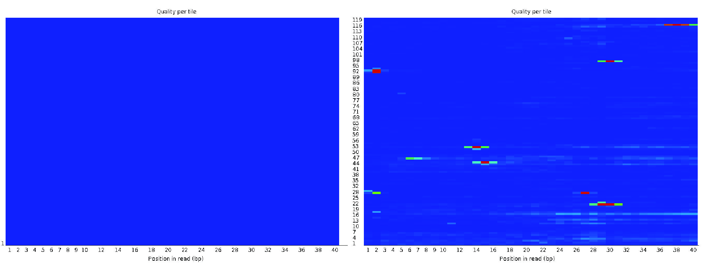

(raw-proc)=

# Raw data processing

In this section, we discuss some of the fundamental issues surrounding what is commonly called "preprocessing" of single-cell and single-nucleus RNA-sequencing (sc/snRNA-seq) data. Though this is common terminology, it seems a bit of a misnomer, as this process involves several
steps that make important decisions about how to deal with and represent the data that can enable or preclude subsequent analyses. Here, we will primarily refer to this phase of processing as "raw data processing", and our focus will be on the phase of data analysis that begins with lane-demultiplexed FASTQ files, and ends with a count matrix representing the estimated number of distinct molecules arising from each gene within each quantified cell, potentially stratified by the inferred splicing status of each molecule ({numref}`raw-proc-fig-overview`).

:::{figure-md} raw-proc-fig-overview


An overview of the topics discussed in this chapter. In the plot, "txome" stands for transcriptome.
:::

This count matrix then serves as the input for the myriad methods that have been developed for various analyses carried out with scRNA-seq data {cite}`raw:Zappia2021`, from methods for normalization, integration, and filtering through methods for inferring cell types, developmental trajectories, and expression dynamics. Given that it serves as the starting point for all of these analyses, a robust and accurate estimation of this matrix is a foundational and critical step to support and enable accurate and reliable subsequent analyses. Fundamental misestimation in raw data processing can contribute to invalid inferences in higher-level analyses and can preclude discoveries based on the signal present in the raw data, which has been missed, diminished, or distorted by raw data processing. As we will see in this section, despite the intuitive nature of the input and output we seek from this step in the processing pipeline, several important and difficult challenges arise during raw data processing, and improved computational methodology for dealing with these challenges is still being actively developed. In particular, we will cover the fundamental steps in raw data processing, including read alignment/mapping, cell barcode (CB) identification and correction, and the estimation of molecule counts through the resolution of unique molecular identifiers (UMIs). We will also mention the choices and challenges that surface when performing these processing steps.

```{admonition} A note on what precedes raw data processing
The decision of where to begin discussing raw data processing is somewhat arbitrary. We note that while, here, we consider starting with lane-demultiplexed FASTQ files as the _raw_ input, even this already represents data that has been processed
and transformed from raw measurements. Further, some of the processing that precedes the generation of the FASTQ files is relevant to challenges that may arise in subsequent processing. For example, the process of base calling and base quality estimation affects the errors that arise in the FASTQ representation of the sequenced fragments, as well as the instrument's estimation of the confidence of each called nucleotide. Further, issues can arise upstream of FASTQ generation, such as index hopping {cite}`farouni2020model`, though these issues can be largely mitigated both with _in silico_ approaches {cite}`farouni2020model` and through enhanced protocols such as [dual indexing](https://www.10xgenomics.com/blog/sequence-with-confidence-understand-index-hopping-and-how-to-resolve-it). In this section, however, we will not consider upstream effects such as these, and instead will consider the FASTQ files, derived from, e.g., BCL files via [appropriate tools](https://support.10xgenomics.com/single-cell-gene-expression/software/pipelines/latest/using/bcl2fastq-direct), as the raw input under consideration.
```

## Raw data quality control

Once raw FASTQ files have been obtained, the quality of the reads themselves can be quickly diagnosed by running a quality control (QC) tool, such as [`FastQC`](https://www.bioinformatics.babraham.ac.uk/projects/fastqc/), to assess read quality, sequence content, etc. If run successfully, `FastQC` generates a QC report for each input FASTQ file. Overall, this report summarizes the quality score, base content, and certain relevant statistics to spot potential problems originating from library preparation or sequencing.

Although nowadays, single-cell raw data processing tools internally evaluate some quality checks that are important for single-cell data, such as the N content of sequences and the fraction of mapped reads, it is still a good habit to run a quick quality check before processing the data, as it evaluates other useful QC metrics.
For readers who are interested in knowing what the `FastQC` report for a FASTQ file from an RNA-seq sample looks like, in the following toggle content, we use the example `FastQC` report of [good](https://www.bioinformatics.babraham.ac.uk/projects/fastqc/good_sequence_short_fastqc.html) together with [bad](https://www.bioinformatics.babraham.ac.uk/projects/fastqc/bad_sequence_fastqc.html) Illumina data provided by the [`FastQC` manual webpage](https://www.bioinformatics.babraham.ac.uk/projects/fastqc/), along with the tutorials and descriptions from [the RTSF at MSU](https://rtsf.natsci.msu.edu/genomics/tech-notes/fastqc-tutorial-and-faq/), [the HBC training program](https://hbctraining.github.io/Intro-to-rnaseq-hpc-salmon/lessons/qc_fastqc_assessment.html), and [the QC Fail website](https://sequencing.qcfail.com/software/fastqc/) to demonstrate the modules in the `FastQC` report. The detailed description of these modules can be found on the `FastQC` [manual webpage](https://www.bioinformatics.babraham.ac.uk/projects/fastqc/). Although these tutorials are not explicitly made for single-cell data, the many of the results are still relevant for single-cell data, with a few caveats described below. In the toggle section, all graphs, except specifically mentioned, are taken from the example reports on the `FastQC` [manual webpage](https://www.bioinformatics.babraham.ac.uk/projects/fastqc/). Finally, most of the metrics reported in such quality control reports make sense only for the "biological" reads of a single-cell dataset (i.e. the read being drawn from gene transcripts). For example, for 10x Chromium v2 and v3 datasets, this would be read 2 (the files containing `R2` in their filename). This is because the technical reads are comprised primarily of barcode and UMI sequences which are not drawn from the underlying transcriptome and which we do not expect to have typical biologically plausible sequence or GC content, though certain metrics like the fraction of `N` base calls are still relevant.

```{toggle}

**0. Summary**

The summary panel on the left-hand side of the HTML report shows the module names included in the report, together with a sign used for quick evaluation of the module results. However, because `FastQC` uses uniform thresholds for files generated from all kinds of sequencing platforms and underlying biological material, we sometimes see warnings (orange exclamation) and failures(red crosses) for good data and passes (green ticks) for questionable data. So, all modules should be carefully evaluated before concluding about the data quality.

:::{figure-md} raw-proc-fig-fastqc-summary


The summary panel of a bad example.
:::

**1. Basic Statistics**

The basic statistics module contains the overview information and statistics of the reads in the input FASTQ file, such as the filename, total number of sequences, number of poor quality sequences, sequence length, and the overall %GC of all bases in all sequences. Good single-cell data usually have a very little number of poor quality sequences and most often have uniform sequence length. The GC content should match the overall GC content of the genome or transcriptome of the sequenced species.

:::{figure-md} raw-proc-fig-fastqc-basic-statistics


A good basic statistics report example.
:::

**2. Per Base Sequence Quality**

The per base sequence quality view contains a BoxWhisker type plot for each position in the read, which shows the range of quality scores across all bases at each position along all reads in the file. The x-axis represents the positions in the read, and the y-axis shows the quality scores. For single-cell data of good quality, all yellow boxes in the view, which represent the inter-quantile range of the quality scores of positions, should fall into the green (calls of good quality) area. So do all the whiskers, which represent the 10\% and 90\% of the distribution. It is not unexpected to see that the quality scores drop along the body of the reads, and some base calls of the last positions fall into the orange (calls of reasonable quality) area because of the decrease in the signal-to-noise ratio that is common in most sequencing-by-synthesis methods. Still, boxes should fall outside of the red (calls of poor quality) area. If poor quality calls are observed, one may consider performing quality trimming of their reads. [A detailed explanation](https://hbctraining.github.io/Intro-to-rnaseq-hpc-salmon/lessons/qc_fastqc_assessment.html) of the sequencing error profiles is provided by the [HBC training program](https://hbctraining.github.io/main/).

:::{figure-md} raw-proc-fig-fastqc-per-read-sequence-quality


A good (left) and a bad (right) per-read sequence quality graph.
:::

**3. Per Tile Sequence Quality**

Using an Illumina library, the per tile sequence quality plot shows the deviation from the average quality for the reads in each flowcell tile that was sequenced. The "hotter" the color, the larger the deviation. For high-quality data, we should see blue over the entire plot, meaning that the flowcell has consistent quality in all tiles. If only part of a flowcell has poor quality, some hot colors will appear in the plot. In that case, the sequencing step might have encountered transient problems, such as bubbles going through the flowcell or smudges and debris inside the flowcell lane. For further diagnoses, please refer to [QC Fail](https://sequencing.qcfail.com/articles/position-specific-failures-of-flowcells/) and [common reasons for warnings](https://www.bioinformatics.babraham.ac.uk/projects/fastqc/Help/3%20Analysis%20Modules/12%20Per%20Tile%20Sequence%20Quality.html) from `FastQC`.

:::{figure-md} raw-proc-fig-fastqc-per-tile-sequence-quality


A good (left) and a bad (right) per tile sequence quality view.
:::

**4. Per Sequence Quality Scores**

The per sequence quality score plot shows the distribution of the average quality score of each read in the file. The x-axis shows the average quality scores, and the y-axis represents the frequency of each quality score. For good data, this plot should have only one peak at the tail. If some other peaks show up, a subset of reads might have some quality issue.

:::{figure-md} raw-proc-fig-fastqc-per-sequence-quality-scores


A good (left) and a bad (right) per sequence quality score plot.
:::

**5. Per Base Sequence Content**

The per base sequence content plot reports the percent of each base position of all reads in the file for which each of the four nucleotides has been called. For single-cell data, it is not uncommon to see fluctuations at the start of the lines because the first bases of reads represent the sequence of the priming sites, which may not be perfectly random, as explained on the [QC Fail website](https://sequencing.qcfail.com/articles/positional-sequence-bias-in-random-primed-libraries/). This happens frequently in RNA-seq libraries, even though `FastQC` will call a warning or failure.

:::{figure-md} raw-proc-fig-fastqc-per-base-sequence-content


A good (left) and bad (right) per base sequence content plot.
:::

**6. Per Sequence GC Content**

The per sequence GC content plot shows the distribution of GC content over all of the reads in red and a theoretical (expected) distribution in blue. The central peak of the observed distribution should correspond to the overall GC content of the underlying transcriptome. Sometimes we see a wider or narrower distribution than the theoretical distribution because the GC content of the transcriptome might differ from the genome, which, in theory, should follow the distribution shown in blue. Such differences in the spread of the distributions are not uncommon, even though it may trigger a warning or failure. However, a complex distribution usually indicates a contaminated library. It is worth noting, however, that a GC content plot can be somewhat complicated to interpret in transcriptomics experiments, as the expected GC content distribution depends not only on the sequence content of the underlying transcriptome, but also on the expression of the genes in the sample, which are unknown.

:::{figure-md} raw-proc-fig-fastqc-per-sequence-gc-content


A good (left) and a bad (right) per sequence GC content plot. The plot on the left is from [the RTSF at MSU](https://rtsf.natsci.msu.edu/genomics/tech-notes/fastqc-tutorial-and-faq/). The plot on the right is taken from [the HBC training program](https://hbctraining.github.io/Intro-to-rnaseq-hpc-salmon/lessons/qc_fastqc_assessment.html).
:::

**7. Per Base N Content**

The per base N content plot shows the percent of bases at each position for which an ``N`` was called, which will occur when the sequencer has insufficient confidence to make a base call. In a high-quality library, we should not expect any noticeable non-zero ``N`` content throughout the line.


:::{figure-md} raw-proc-fig-fastqc-per-base-n-content


A good (left) and a bad (right) per base N content plot.
:::

**8. Sequence Length Distribution**

The Sequence length distribution graph shows the distribution of the read lengths. In most single-cell chemistries, all reads will be of the same length. If trimming was performed before quality assessment, there may be some small variation in read lengths.

:::{figure-md} raw-proc-fig-fastqc-sequence-length-distribution


A good (left) and a bad (right) sequence length distribution plot.
:::

**9. Sequence Duplication Levels**

The sequence duplication level plot shows the distribution of the degree of duplication for read sequences (the blue line) and those after deduplication. As most single-cell platform requires multiple rounds of PCR, highly expressed genes usually express a large number of transcripts, and FastQC itself is not UMI aware, it is common that a small subset of sequences may have a large number of duplications. This may trigger a warning or failure for this module, but it does not necessarily represent a quality problem with the data. Still, the majority of sequences should have a low duplication level.

:::{figure-md} raw-proc-fig-fastqc-sequence-duplication-levels


A good (left) and a bad (right) per sequence duplication levels plot.
:::

**10. Overrepresented Sequences**

The overrepresented sequences module lists all read sequences that make up more than $0.1\%$ of the total number of sequences. We might see some overrepresented sequences from the highly expressed genes after PCR amplification, but most sequences should not be overrepresented. Note that if the possible source of the overrepresented sequences is not "No Hit", it might indicate that the library is contaminated by the corresponding type of source.

:::{figure-md} raw-proc-fig-fastqc-overrepresented-sequences


An overrepresented sequence table.
:::

**11. Adapter Content**

The adapter content module shows the cumulative percentage of the fraction of reads in which each of the adapter sequences has been observed at each base position. Ideally, we should not see any abundant adapter sequences in the data.

:::{figure-md} raw-proc-fig-fastqc-adapter-content


A good (left) and a bad (right) per sequence quality score plot. The plot on the right is from [the QC Fail website](https://sequencing.qcfail.com/articles/read-through-adapters-can-appear-at-the-ends-of-sequencing-reads/).
:::

```

(raw-proc:aln-map)=

## Alignment and mapping

Mapping or alignment is a fundamental step in single-cell raw data processing. It refers to the process of determining the potential loci of origin of each sequenced fragment (e.g., the set of genomic or transcriptomic loci that are similar to the read). Depending on the sequencing protocol, the resulting raw sequence file contains the cell-level information, commonly known as cell barcodes (CB), the unique molecule identifier (UMI), and the raw cDNA sequence (read sequence) generated from the molecule. As the first step in the raw data processing of a single-cell sample ({numref}`raw-proc-fig-overview`), executing mapping or alignment accurately is instrumental for all downstream analyses, since incorrect read-to-transcript/gene mapping can lead to wrong or inaccurate matrices.

While mapping read sequences to reference sequences _far_ predates the advent of scRNA-seq, the current and quickly growing scale of scRNA-seq samples (typically hundreds of millions to billions of reads) makes this stage particularly computationally intensive. Additionally, using pre-existing RNA-seq aligners that are agnostic to any specific scRNA-seq protocol -- like the length and position of cell barcodes, UMI, etc. -- requires making use of separate tools for performing other steps such as demultiplexing and UMI resolutions {cite}`Smith2017`. This added overhead can be computationally cumbersome. Further, it typically carries a substantial disk space requirement for storing intermediate files, and the extra input and output operations required for processing such intermediate files further increase runtime requirements.

To this end, several dedicated tools have been built specifically for aligning or mapping scRNA-seq data, which handle these additional processing requirements automatically and/or internally. Tools such as `Cell Ranger` (commercial software from 10x Genomics) {cite}`raw:Zheng2017`, `zUMIs` {cite}`zumis`, `alevin` {cite}`Srivastava2019`, `RainDrop` {cite}`niebler2020raindrop`, `kallisto|bustools` {cite}`Melsted2021`, `STARsolo` {cite}`Kaminow2021` and `alevin-fry` {cite}`raw:He2022` provide dedicated treatment for aligning scRNA-seq reads along with parsing of technical read content (CBs and UMIs), as well as methods for demultiplexing and UMI resolution.
While all provide relatively simplified interfaces to the user, these tools use a variety of different approaches internally, with some generating traditional intermediate files (e.g., BAM files) and subsequently processing them, and others either working entirely in memory or by making use of reduced intermediate representations to reduce the input/output burden.

%A further benefit of all these tools is their reliance on pre-existing mapping/alignment engine that the tool relies on. As a result, the pre-existing user base and the tutorials make these tools more amenable to new users.

While the specific algorithms, data structures, and time and space trade-offs made by different alignment and mapping approaches can vary greatly, we can roughly categorize existing approaches along two axes:

- The type of mapping they perform and
- The type of reference sequence against which they map reads.

(raw-proc:types-of-mapping)=

### Types of mapping

Here we consider three main types of mapping algorithms that are most commonly applied in the context of mapping sc/snRNA-seq data: spliced alignment, contiguous alignment, and variations of lightweight mapping.

First, let us draw a distinction here between alignment-based approaches and lightweight mapping-based approaches ({numref}`raw-proc-fig-alignment-mapping`). Alignment approaches apply a range of different heuristics to determine the potential loci from which reads may arise and then subsequently score, at each putative locus, the best nucleotide-level alignment between the read and reference, typically using dynamic programming-based approaches. Using dynamic programming algorithms to solve the alignment problem has a long and rich history. The exact type of dynamic programming algorithm used depends on the type of alignment being sought. [Global alignment](https://en.wikipedia.org/wiki/Needleman%E2%80%93Wunsch_algorithm) is applicable for the case where the entirety of the query and reference sequence are to be aligned. On the other hand, [local alignment](https://en.wikipedia.org/wiki/Smith%E2%80%93Waterman_algorithm) is applicable when, possibly, only a subsequence of the query is expected to match a subsequence of the reference. Typically, the models most applicable for short-read alignment are neither fully global nor fully local, but fall into a category of semi-global alignment where the majority of the query is expected to align to some substring of the reference (this is often called "fitting" alignment). Moreover, it is sometimes common to allow soft-clipping of the alignment so that the penalties for mismatches, insertions, or deletions appearing at the very start or end of the read are ignored or down-weighted. This is commonly done using ["extension" alignment](https://github.com/smarco/WFA2-lib#-33-alignment-span). Though these modifications change the specific rules used in the dynamic programming recurrence and traceback, they do not fundamentally change its overall complexity.

Apart from these general alignment techniques, a number of more sophisticated modifications and heuristics have been designed to make the alignment process more practical and efficient in the context of aligning genomic sequencing reads. For example, `banded alignment` {cite}`chao1992aligning` is a popular heuristic included in the alignment implementation of many popular tools, which avoids computing large parts of the dynamic programming table if the user is uninterested in alignment scores below a certain threshold. Likewise, other heuristics like X-drop {cite}`zhang2000` and Z-drop {cite}`li2018minimap2` are popular for pruning un-promising alignments early. Recent algorithmic progress, such as wavefront alignment {cite}`marco2021fast,marco2022optimal`, allows for determining optimal alignments in asymptotically (and practically) shorter time and smaller space if high-scoring (low divergence) alignments exist. Finally, considerable effort has also been devoted to optimizing data layout and computation in a way that takes advantage of instruction-level parallelism {cite}`wozniak1997using, rognes2000six, farrar2007striped`,and to expressing the alignment dynamic programming recurrences in a manner that is highly amenable to data parallelism and vectorization (e.g., as in the difference encoding of {cite:t}`Suzuki2018`). Most widely-used alignment tools make use of highly-optimized and vectorized alignment implementations.

In addition to the alignment score, a backtrace of the actual alignment that yields this score may be obtained. Such information is typically encoded as a `CIGAR` string (short for "Concise Idiosyncratic Gapped Alignment Report"), a compressed alphanumeric representation of the alignment, within the SAM or BAM file that is output. An example of a `CIGAR` string is `3M2D4M`, which represents that the alignment has three matches or mismatches, followed by a deletion of length two from the read (bases present in the reference but not the read), followed by four more matches or mismatches. Other variants of the `CIGAR` string can also delineate between matches or mismatches. For example, `3=2D2=2X` is a valid extended `CIGAR` string encoding the same alignment as just described, except that it makes clear that the three bases before the deletion constitute matches and that after the deletion, there are two matched bases followed by two mismatched bases. A detailed description of the `CIGAR` string format can be found in [the SAMtools manual](https://samtools.github.io/hts-specs/SAMv1.pdf) or [the SAM wiki page of UMICH](https://genome.sph.umich.edu/wiki/SAM#What_is_a_CIGAR.3F).

At the cost of computing such scores, alignment-based approaches know the quality of each potential mapping of a read, which they can then use to filter reads that align well to the reference from mappings that arise as the result of low complexity or "spurious" matches between the read and reference. Alignment-based approaches include both traditional "full-alignment" approaches, as implemented in tools such as `STAR`{cite}`dobin2013star` and `STARsolo`{cite}`Kaminow2021` as well as approaches like _selective-alignment_ implemented in `salmon`{cite}`Srivastava2020Alignment` and `alevin`{cite}`Srivastava2019`, which score mappings but omit the computation of the optimal alignment's backtrace.

:::{figure-md} raw-proc-fig-alignment-mapping


An abstract overview of the alignment-based method and lightweight mapping-based method.
:::

Alignment-based approaches can be further categorized into spliced-alignment and contiguous-alignment approaches (currently, there are no lightweight-mapping approaches that perform spliced mapping). Spliced-alignment approaches are capable of aligning a sequence read over several distinct segments of a reference, allowing potentially large gaps between the regions of the reference that align well with the corresponding parts of the read. These alignment approaches are typically applied when aligning RNA-seq reads to the genome, since the alignment procedure must be able to align reads that span across one or more splice junctions of the transcript, where a sequence that is contiguous in the read may be separated by intron and exon subsequences (potentially spanning kilobases of sequence) in the reference. Spliced alignment is a challenging problem, particularly in cases where only a small region of the read spans a splicing junction, since very little informative sequence may be available to place the segment of the read that overhangs the splice junction by only a small amount. On the other hand, contiguous alignment seeks a contiguous substring of the reference that aligns well against the read. In such alignment problems, though small insertions and deletions may be allowed, large gaps such as those observed in spliced alignments are typically not tolerated.

Finally, we can draw a distinction between alignment-based methods such as those described above and lightweight-mapping methods, which include approaches such as pseudoalignment {cite}`Bray2016`, quasi-mapping {cite}`srivastava2016rapmap`, and pseudoalignment with structural constraints {cite}`raw:He2022`. Such approaches generally achieve superior speed by avoiding nucleotide-level alignment between the read and reference sequences. Instead, they base the determination of the reported mapping loci of a read on a separate set of rules and heuristics that may look only at the set of matching k-mers or other types of exact matches (e.g., via a consensus rule) and, potentially, their orientations and relative positions with respect to each other on both the read and reference (e.g., chaining). This can lead to substantially increased speed and mapping throughput, but also precludes easily-interpretable score-based assessments of whether or not the matches between the read and reference constitute a good match capable of supporting a high-quality alignment.

(raw-proc:mapping-references)=

### Mapping against different reference sequences

While different choices can be made among the mapping algorithms themselves, different choices can _also_ be made about the reference against which the read is mapped. We consider three main categories of reference sequence against which a method might map:

- The full (likely annotated) reference genome
- The annotated transcriptome
- An augmented transcriptome

It is also worth noting that, currently, not all combinations of mapping algorithms and reference sequences are possible. For example, lightweight mapping-based algorithms do not currently exist that can perform spliced mapping of reads against a reference genome.

(raw-proc:genome-mapping)=

#### Mapping to the full genome

The first type of reference, against which a method may map, consists of the entire genome of the target organism, usually with the annotated transcripts considered during mapping. Tools like `zUMIs` {cite}`zumis`, `Cell Ranger` {cite}`raw:Zheng2017` and `STARsolo` {cite}`Kaminow2021` take this approach. Since many of the reads arise from spliced transcripts, such an approach also requires the use of a splice-aware alignment algorithm where the alignment for a read can be split across one or more splicing junctions. The main benefits of this approach are that reads arising from any location in the genome, not just from annotated transcripts, can be accounted for. Since these approaches require constructing a genome-wide index, there is little marginal cost for reporting not only the reads that map to known spliced transcripts but also reads that overlap or align within introns, making the alignment cost when using such approaches very similar for both single-cell and single-nucleus data. A final benefit is that even reads residing outside of the annotated transcripts, exons, and introns can be accounted for by such methods, which can enable _post hoc_ augmentation of the set of quantified loci (e.g., as is done by {cite:t}`Pool2022` by adding expressed UTR extensions to transcript annotations in a sample-specific and data-driven manner) and potentially increase gene detection and quantification sensitivity.

On the other hand, the versatility of the strategy of performing spliced alignment against the full genome comes with certain trade-offs. First, the most commonly-used alignment tools that adopt this strategy in the single-cell space have substantial memory requirements. Due to its speed and versatility, most of these tools are based upon the STAR {cite}`dobin2013star` aligner. Yet, for a human-scale genome, constructing and storing the index can require upwards of $32$ GB of memory. The use of a sparse [suffix array](https://en.wikipedia.org/wiki/Suffix_array) can reduce the final index size by close to a factor of $2$, but this comes at a reduction in alignment speed, and it still requires larger memory for the initial construction. Second, the increased difficulty of spliced alignment compared to contiguous alignment and the fact that current spliced-alignment tools must explicitly compute a score for each read alignment, means that this approach comes at an increased computational cost compared to the alternatives. Finally, such an approach requires the genome of the organism under study is available. While this is not problematic for the most commonly-studied reference organisms and is rarely an issue, it can make using such tools difficult for non-model organisms where only a transcriptome assembly may be available.

(raw-proc:txome-mapping)=

#### Mapping to the spliced transcriptome

To reduce the computational overhead of spliced alignment to a genome, the widely-adopted alternative is to use just the sequences of the annotated transcripts themselves as a reference. Since the majority of single-cell experiments are generated from model organisms (such as mouse or human), which have well-annotated transcriptomes, such transcriptome-based quantification methods may provide similar read coverage to their genome-based counterparts. Compared to the genome, transcriptome sequences are much smaller in size, minimizing the computational resources required for running the mapping pipeline. Additionally, since the relevant splicing patterns are already represented in the transcript sequences themselves, this approach dispenses with the need to solve the difficult spliced-alignment problem. Instead, one can simply search for contiguous alignments or mappings for the read. Since only contiguous mappings need to be discovered, both alignment and lightweight mapping techniques are amenable to transcriptome references, and both approaches have been used in popular tools that adopt the spliced transcriptome as the target of reference mapping.

However, while such approaches can greatly reduce the memory and time required for alignment and mapping, they will fail to capture reads that arise from outside of the spliced transcriptome. Such an approach is therefore not adequate when processing single-nucleus data. Even in single-cell experiments, reads arising from outside of the spliced transcriptome can constitute a substantial fraction of all data, and there is growing evidence that such reads should be incorporated into subsequent analysis {cite}`technote_10x_intronic_reads,Pool2022`. Further, when paired with lightweight-mapping approaches, short matches shared between the spliced transcriptome and the reference sequences that truly give rise to a read may lead to spurious read mappings, which, in turn, can lead to spurious and even biologically implausible estimates of the expression of certain genes {cite}`Kaminow2021,Bruning2022Comparative,raw:He2022`.

(raw-proc:aug-txome-mapping)=

#### Mapping to an augmented transcriptome

To deal with the fact that sequenced reads may arise from outside of spliced transcripts, it is possible to augment the spliced transcript sequences with other reference sequences that may be expected to give rise to reads (e.g., full-length unspliced transcripts or excised intronic sequences). Transcriptome references, when augmented with further sequences such as introns, allow reference indices typically smaller than those required for the full genome while simultaneously retaining the ability to search only for contiguous read alignments. This means they can potentially enable both faster and less memory-hungry alignment than when mapping against the full genome while still accounting for many of the reads that arise from outside of the spliced transcriptome. Finally, by mapping to an expanded collection of reference sequences, not only are the mapping locations of more reads recovered compared to mapping against just the spliced transcriptome, but when using lightweight mapping-based approaches, spurious mappings can be greatly reduced {cite}`raw:He2022`. Such an expanded or augmented transcriptome is commonly used among approaches (those that do not map to the full genome) when they need to quantify single-nucleus data or prepare data for RNA-velocity analysis {cite}`Soneson2021Preprocessing`. Therefore, such augmented references can be constructed for all of the common methods that don't make use of spliced alignment to the full genome {cite}`Srivastava2019,Melsted2021,raw:He2022`.

{cite:t}`raw:He2022` argue that such an approach is valuable even when processing standard single-cell RNA-seq data and recommend constructing an augmented _splici_ (meaning spliced + intronic) reference for mapping and quantification. The _splici_ reference is constructed using the spliced transcriptome sequence along with the sequences containing the merged intervals corresponding to the introns of the annotated genes. Each reference is then labeled with its annotated splicing status, and the mapping to this reference is subsequently paired with splicing status-aware methods for {ref}`raw-proc:umi-resolution`. The main benefits of this approach are that it admits the use of lightweight-mapping methods while substantially reducing the prevalence of spurious mappings. It enables the detection of reads of both spliced and unspliced origin, which can increase the sensitivity of subsequent analysis {cite}`technote_10x_intronic_reads,Pool2022`, and, since splicing status is tracked during quantification and reported separately in the output, it unifies the processing pipeline for single-cell, single-nucleus, and RNA-velocity preprocessing.

(raw-proc:cb-correction)=

## Cell barcode correction

Droplet-based single-cell segregation systems, such as those provided by 10x Genomics, have become an important tool for studying the cause and consequences of cellular heterogeneity. In this segregation system, the RNA material of each captured cell is extracted within a water-based droplet encapsulation along with a barcoded bead. These beads tag the RNA content of individual cells with unique oligonucleotides, called cell barcodes (CBs), that are later sequenced along with the fragments of the cDNAs that are reversely transcribed from the RNA content. The beads contain high-diversity DNA barcodes enabling parallel barcoding of the cell's molecular content and _in silico_ demultiplexing of the sequencing reads into individual cellular bins.

```{admonition} A note on alignment orientation

Depending on the chemistry of the sample being analyzed and the processing options provided by the user, it is not necessarily the case that all sequenced fragments aligning to the reference will be considered for quantification and barcode correction.
One commonly-applied criterion for filtering is alignment orientation. Specifically, certain chemistries specify protocols such that the aligned reads should only derive from (i.e. map back to) the underlying transcripts in a specific orientation.
For example, in 10x Genomics 3' Chromium chemistries, we expect the biological read to align to the underlying transcript's forward strand, though anti-sense reads do exist {cite}`technote_10x_intronic_reads`. Thus, mappings of the reads in the reverse-complement orientation to the underlying sequences may be ignored or filtered out at the user's discretion. If a chemistry follows such a so-called "stranded" protocol, this should be documented.
```

### Type of errors in barcoding

The tag, sequence, and demultiplex method for single-cell profiling generally works well. However, the number of observed cell barcodes (CBs) in a droplet-based library can significantly differ from the number of originally encapsulated cells by several fold. A few main sources of error can lead to such observation:

- Doublet / Multiplet: A single barcode can be associated with two or more cells and lead to undercounting of cells.
- Empty Droplet: A droplet can be captured with no encapsulated cell, where the ambient RNA is tagged with the barcode and can be sequenced; this leads to overcounting of cells.
- Sequence error: Errors can arise during the PCR amplification or sequencing process and can contribute to both under and over-counting of the cells.

Computational tools for demultiplexing the {term}`RNA`-seq reads into cell-specific bins use a wide range of diagnostic indicators to filter out artefactual or low-quality data. For example, numerous methods exist for the removal of ambient {term}`RNA` contamination {cite}`raw:Young2020,Muskovic2021,Lun2019`, doublet detection {cite}`DePasquale2019,McGinnis2019,Wolock2019,Bais2019` and cell barcodes correction for sequence errors based on nucleotide sequence similarity.

Several common strategies are used for cell barcode identification and correction.

- Correction against a known list of _potential_ barcodes: Certain chemistries, such as 10x Chromium, draw CBs from a known pool of potential barcode sequences. Thus, the set of barcodes observed in any sample is expected to be a subset of this known list, often called a "whitelist", "permit list", or "pass list". In this case, a common strategy is to assume each barcode that exactly matches some element from the known list is correct and for all other barcodes to be correct against the known list of barcodes (i.e., to find barcodes from the permit list that are some small Hamming distance or edit distance away from the observed barcodes). This approach leverages the known permit list to allow efficient correction of many barcodes that have been potentially corrupted. However, one difficulty with this approach is that a given corrupted barcode may have multiple possible corrections in the permit list (i.e., its correction may be ambiguous). In fact, if one considers a barcode that is taken from the [10x Chromium v3 permit list](https://github.com/10XGenomics/cellranger/blob/master/lib/python/cellranger/barcodes/3M-february-2018.txt.gz) and mutated at a single position to a barcode not in the list, there is a $\sim 81\%$ chance that it sits at Hamming distance $1$ from two or more barcodes in the permit list. The probability of such collisions can be reduced by only considering correcting against barcodes from the known permit list, which, themselves, occur exactly in the given sample (or even only those that occur exactly in the given sample above some nominal frequency threshold). Also, information such as the base quality at the "corrected" position can be used to potentially break ties in the case of ambiguous corrections. Yet, as the number of assayed cells increases, insufficient sequence diversity in the set of potential cell barcodes increases the frequency of ambiguous corrections, and reads tagged with barcodes having ambiguous corrections are most commonly discarded.

- Knee or elbow-based methods: If a set of potential barcodes is unknown — or even if it is known, but one wishes to correct directly from the observed data itself without consulting an external list — one can adopt a method based on the observation that the list of "true" or high-quality barcodes in a sample is likely those associated with the greatest number of reads.
  To do this, one can construct the cumulative frequency plot of the barcodes, in which barcodes are sorted in descending order of the number of distinct reads or UMIs with which they are associated. Often, this ranked cumulative frequency plot will contain a "knee" or "elbow" – an inflection point that can be used to characterize frequently occurring barcodes from infrequent (and therefore likely erroneous) barcodes. Many methods exist for attempting to identify such an inflection point {cite}`Smith2017,Lun2019,raw:He2022` as a likely point of discrimination between properly captured cells and empty droplets. Subsequently, the set of barcodes that appear "above" the knee can be treated as a permit list against which the rest of the barcodes may be corrected, as in the first method list above. Such an approach is flexible as it can be applied in chemistries that have an external permit list and those that don't. Further parameters of the knee-finding algorithms can be altered to yield more or less restrictive selected barcode sets. Yet, such an approach can have certain drawbacks, like a tendency to be overly conservative and sometimes failing to work robustly in samples where no clear knee is present.

- Filtering and correction based on an expected cell count provided by the user: These approaches seek to estimate a robust list of high-quality or present barcodes in the cases where the CB frequency distribution may not have a clear knee or exhibit bimodality due to technical artifacts. In such an approach, the user provides an estimate of the expected number of assayed cells. Then, the barcodes are ordered by descending frequency, the frequency $f$ at a robust quantile index near the expected cell count is obtained, and all cells having a frequency within a small constant fraction of $f$ (e.g., $\ge \frac{f}{10}$) are considered as valid barcodes. Again, the remaining barcodes are corrected against this valid list by attempting to correct uniquely to one of these valid barcodes based on sequence similarity.

- Filtering based on a forced number of valid cells: Perhaps the simplest approach, although potentially problematic, is for the user to directly provide the index in the sorted frequency plot above which barcodes will be considered valid. All barcodes with a frequency greater than or equal to the frequency at the selected index are considered valid and treated as constituting the permit list. The remaining set of barcodes is then corrected against this list using the same approach described in the other methods above. If there are at least as many distinct barcodes as the number of cells the user requests, then this many cells will always be selected. Of course, such an approach is only reasonable when the user has a good reason to believe that the threshold frequency should be set around the provided index.

%In the `alevin-fry` framework, the frequency of every observed cell barcode is generated, and there are four customizable options to select the high-quality cell barcodes for downstream analysis:

### Future challenges

While cellular barcoding of high-throughput single-cell profiling has been a tremendously successful approach, some challenges still remain, especially as the scale of experiments continues to grow. For example, the design of a robust method for selecting high-quality cell barcodes from the set of all the observations is still an active area of research, with distinct challenges arising, e.g., between single-cell and single-nucleus experiments. Also, as single-cell technologies have advanced to profile increasing numbers of cells, insufficient sequence diversity in the CB sequence can result in sequence corrections leading to CB collision. Addressing this latter problem may require more intelligent barcode design methods and continuing increases in the lengths of oligonucleotides used for cell barcoding.

(raw-proc:umi-resolution)=

## UMI resolution

After cell barcode (CB) correction, reads have either been discarded or assigned to a corrected CB. Subsequently, we wish to quantify the abundance of each gene within each corrected CB.

Because of the amplification bias as discussed in {ref}`exp-data:transcript-quantification`, reads must be deduplicated, based upon their UMI, to assess the true count of sampled molecules. Additionally, several other complicating factors present challenges when attempting to perform this estimation.

The UMI deduplication step aims to identify the set of reads and UMIs derived from each original, pre-PCR molecule in each cell captured and sequenced in the experiment. The result of this process is to allocate a molecule count to each gene in each cell, which is subsequently used in the downstream analysis as the raw expression estimate for this gene. We refer to this process of looking at the collection of observed UMIs and their associated mapped reads and attempting to infer the original number of observed molecules arising from each gene as the process of _UMI resolution_.

To simplify the explanation, in the following text, the reads that map to a reference, for example, a genomic locus of the gene, are called the reads of that reference, and their UMI tags are called the UMIs of that reference; the set of reads that are tagged by a UMI is called the reads of that UMI. A read can only be tagged by one UMI but can belong to multiple references if it maps to multiple references. Furthermore, as the molecule barcoding process for each cell in scRNA-seq is usually isolated and independent (apart from the issues related to accurately resolving cell barcodes raised earlier), without loss of generality, _UMI resolution_ will be explained for a specific cell. The same procedure will usually be applied to all cells independently.

(raw-proc:need-for-umi-resolution)=

### The need for UMI resolution

In the ideal case, where the correct (unaltered) UMIs tag reads, the reads of each UMI uniquely map to a common reference gene, and there is a bijection between UMIs and pre-PCR molecules. Consequently, the UMI deduplication procedure is conceptually straightforward: the reads of a UMI are the PCR duplicates from a single pre-PCR molecule. The number of captured and sequenced molecules of each gene is the number of distinct UMIs observed for this gene.

However, the problems encountered in practice make the simple rules described above insufficient for identifying the gene origin of UMIs in general and necessitate the development of more sophisticated models. Here, we concern ourselves primarily with two challenges.

- The first problem we discuss is errors in UMIs. These occur when the sequenced UMI tag of reads contains errors introduced during PCR or the sequencing process. Common UMI errors include nucleotide substitutions during PCR and read errors during sequencing. Failing to address such UMI errors can inflate the estimated number of molecules {cite}`Smith2017,ziegenhain2022molecular`.

- The second issue we discuss is multimapping, which arises in cases where a read or UMI belongs to multiple references, for example, multi-gene reads/UMIs. This happens if different reads of a UMI map to different genes, a read maps to multiple genes, or both. The consequence of this issue is that the gene origin of the multi-gene reads/UMIs is ambiguous, which results in uncertainty about the sampled pre-PCR molecule count of those genes. Simply discarding multi-gene reads/UMIs can lead to a loss of data or a biased estimate among genes that tend to produce multimapping reads, such as sequence-similar gene families{cite}`Srivastava2019`.

```{admonition} A note on UMI errors
UMI errors, especially those due to nucleotide substitutions and miscallings, are prevalent in single-cell experiments. {cite:t}`Smith2017` establish that the average number of bases different (edit distance) between the observed UMI sequences in the tested single-cell experiments is lower than randomly sampled UMI sequences, and the enrichment of low edit distances is well correlated with the degree of PCR amplification. Multimapping also exists in single-cell data and, depending upon the gene being considered, can occur at a non-trivial rate. {cite:t}`Srivastava2019` show that discarding the multimapping reads can negatively bias the predicted molecule counts.
```

There exist other challenges that we do not focus upon here, such as "convergent" and "divergent" UMI collisions. We consider the case where the same UMI is used to tag two different pre-PCR molecules arising from the same gene, in the same cell, as a convergent collision. When two or more distinct UMIs arise from the same pre-PCR molecule, e.g., due to the sampling of multiple priming sites from this molecule, we consider this a divergent collision. We expect convergent UMI collisions to be rare and, therefore, their effect typically small. Further, transcript-level mapping information can sometimes be used to resolve such collisions{cite}`Srivastava2019`. Divergent UMI collisions occur primarily among introns of unspliced transcripts{cite}`technote_10x_intronic_reads`, and approaches to addressing the issues they raise are an area of active research{cite}`technote_10x_intronic_reads,Gorin2021`.

Given that the use of UMIs is near ubiquitous in high-throughput scRNA-seq protocols and the fact that addressing these errors improves the estimation of gene abundances, there has been much attention paid to the problem of UMI resolution in recent literature {cite}`Islam2013,Bose2015,raw:Macosko2015,Smith2017,Srivastava2019,Kaminow2021,Melsted2021,raw:He2022,calib,umic,zumis`.

(raw-proc:graph-based-umi-resolution)=

### Graph-based UMI resolution

As a result of the problems that arise when attempting to resolve UMIs, many methods have been developed to address the problem of UMI resolution. While there are a host of different approaches for UMI resolution, we will focus on a framework for representing problem instances, modified from a framework initially proposed by {cite:t}`Smith2017`, that relies upon the notion of a _UMI graph_. Each connected component of this graph represents a sub-problem wherein certain subsets of UMIs are collapsed (i.e., resolved as evidence of the same pre-PCR molecule). Many popular UMI resolution approaches can be interpreted in this framework by simply modifying precisely how the graph is refined and how the collapse or resolution procedure carried out over this graph works.

In the context of single-cell data, a UMI graph $G(V,E)$ is a directed graph with a node set $V$ and an edge set $E$. Each node $v_i \in V$ represents an equivalence class (EC) of reads, and the edge set $E$ encodes the relationship between the ECs. The equivalence relation $\sim_r$ defined on reads is based on their UMI and mapping information. We say reads $r_x$ and $r_y$ are equivalent, $r_x \sim_r r_y$, if and only if they have identical UMI tags and map to the same set of references. UMI resolution approaches may define a "reference" as a genomic locus{cite}`Smith2017`, transcript{cite}`Srivastava2019,raw:He2022` or gene{cite}`raw:Zheng2017,Kaminow2021`. Other UMI resolution approaches exist, for example, the reference-free model{cite}`umic` and the method of moments{cite}`Melsted2021`, but they may not be easily represented in this framework and are not discussed in further detail here.

In the UMI graph framework, a UMI resolution approach can be divided into three major steps, each of which has different options that can be modularly composed by different approaches. The three steps are defining nodes, defining adjacency relationships, and resolving components. Additionally, these steps may sometimes be preceded (and/or followed) by filtering steps designed to discard or heuristically assign (by modifying the set of reference mappings reported) reads and UMIs exhibiting certain types of mapping ambiguity.

(raw-proc:umi-graph-node-def)=

#### Defining nodes

As described above, a node $v_i \in V$ is an equivalence class of reads. Therefore, $V$ can be defined based on the full or filtered set of mapped reads and their associated _uncorrected_ UMIs. All reads that satisfy the equivalence relation $\sim_r$ based on their reference set and UMI tag are associated with the same vertex $v \in V$. An EC is a multi-gene EC if its UMI is a multi-gene UMI. Some approaches will avoid the creation of such ECs by filtering or heuristically assigning reads prior to node creation, while other approaches will retain and process these ambiguous vertices and attempt and resolve their gene origin via parsimony, probabilistic assignment, or based on a related rule or model {cite}`Srivastava2019,Kaminow2021,raw:He2022`.

(raw-proc:umi-graph-edge-def)=

#### Defining the adjacency relationship

After creating the node set $V$ of a UMI graph, the adjacency of nodes in $V$ is defined based on the distance, typically the Hamming or edit distance, between their UMI sequences and, optionally, the content of their associated reference sets.

Here we define the following functions on the node $v_i \in V$:

- $u(v_i)$ is the UMI tag of $v_i$.
- $c(v_i) = |v_i|$ is the cardinality of $v_i$, i.e., the number of reads associated with $v_i$ that are equivalent under $\sim_r$.
- $m(v_i)$ is the reference set encoded in the mapping information, for $v_i$.
- $D(v_i, v_j)$ is the distance between $u(v_i)$ and $u(v_j)$, where $v_j \in V$.

Given these function definitions, any two nodes $v_i, v_j \in V$ will be incident with a bi-directed edge if and only if $m(v_i) \cap m(v_j) \ne \emptyset$ and $D(v_i,v_j) \le \theta$, where $\theta$ is a distance threshold and is often set as $\theta=1${cite}`Smith2017,Kaminow2021,Srivastava2019`. Additionally, the bi-directed edge might be replaced by a directed edge incident from $v_i$ to $v_j$ if $c(v_i) \ge 2c(v_j) -1$ or vice versa{cite}`Smith2017,Srivastava2019`. Though these edge definitions are among the most common, others are possible, so long as they are completely defined by the $u$, $c$, $m$, and $D$ functions. With $V$ and $E$ in hand, the UMI graph $G = (V,E)$ is now defined.

(raw-proc:umi-graph-resolution-def)=

#### Defining the graph resolution approach

Given the defined UMI graph, many different resolution approaches may be applied. A resolution method may be as simple as finding the set of connected components, clustering the graph, greedily collapsing nodes or contracting edges{cite}`Smith2017`, or searching for a cover of the graph by structures following certain rules (e.g., monochromatic arboresences{cite}`Srivastava2019`) to reduce the graph. As a result, each node in the reduced UMI graph, or each element in the cover in the case that the graph is not modified dynamically, represents a pre-PCR molecule. The collapsed nodes or covering sets are regarded as the PCR duplicates of that molecule.

Different rules for defining the adjacency relationship and different approaches for graph resolution itself can seek to preserve different properties and can define a wide variety of distinct overall UMI resolution approaches. Note that for the approaches that aim to probabilistically resolve the ambiguity caused by multimapping, the resolved UMI graph might contain multi-gene ECs, and their gene origin will be resolved in the following step.

(raw-proc:umi-graph-quantification)=

#### Quantification

The last step in UMI resolution is quantifying the abundance of each gene using the resolved UMI graph. For approaches that discard multi-gene ECs, the molecule count vector for the genes in the current cell being processed (or count vector for short) is generated by counting the number of ECs labeled with each gene. On the other hand, approaches that process, rather than discard, multi-gene ECs usually resolve the ambiguity by applying some statistical inference procedure. For example, {cite:t}`Srivastava2019` introduce an expectation-maximization (EM) approach for probabilistically assigning multi-gene UMIs, and related EM algorithms have also been introduced as optional steps in subsequent tools{cite}`Melsted2021,Kaminow2021,raw:He2022`. In this model, the collapsed-EC-to-gene assignments are latent variables, and the deduplicated molecule count of genes are the main parameters. Intuitively, evidence from gene-unique ECs will be used to help probabilistically apportion the multi-gene ECs. The EM algorithm seeks the parameters that together have the (locally) highest likelihood of generating the observed ECs.

Usually, the UMI resolution and quantification process described above will be performed separately for each cell, represented by a corrected CB, to create a complete count matrix for all genes in all cells. However, the relative paucity of per-cell information in high-throughput single-cell samples limits the evidence available when performing UMI resolution, which in turn limits the potential efficacy of model-based solutions like the statistical inference procedure described above.
Thus, further research here is certainly warranted. For example, {cite:t}`Srivastava2020-lf` introduced an approach that allows sharing information among transcriptionally similar cells to improve the quantification result further.

(raw-proc:count-qc)=

## Count matrix quality control

Once a count matrix has been generated, it is important to perform a quality control (QC) assessment.
There are several distinct assessments that generally fall under the rubric of quality control.
Basic global metrics are often recorded and reported to help assess the overall quality of the sequencing measurement itself. These metrics consist of quantities such as the total fraction of mapped reads, the distribution of distinct UMIs observed per cell, the distribution of UMI deduplication rates, the distribution of detected genes per cell, etc. These and similar metrics are often recorded by the quantification tools themselves{cite}`raw:Zheng2017,Kaminow2021,Melsted2021,raw:He2022` since they arise naturally and can be computed during the process of read mapping, cell barcode correction, and UMI resolution. Likewise, there exist several tools to help organize and visualize these basic metrics, such as the [Loupe browser](https://support.10xgenomics.com/single-cell-gene-expression/software/visualization/latest/what-is-loupe-cell-browser), [alevinQC](https://github.com/csoneson/alevinQC), or a [kb_python report](https://github.com/pachterlab/kb_python), depending upon the quantification pipeline being used. Beyond these basic global metrics, at this stage of analysis, QC metrics are designed primarily to help determine which cells (CBs) have been sequenced "successfully", and which exhibit artifacts that warrant filtering or correction.

In the following toggle section, we discuss an example alevinQC report taken from the `alevinQC` [manual webpage](https://github.com/csoneson/alevinQC).

```{toggle}

Once `alevin` or `alevin-fry` quantifies the single-cell data, the quality of the data can be assessed through the R package [`alevinQC`](https://github.com/csoneson/alevinQC). The alevinQC report can be generated in PDF format or as R/Shiny applications, which summarizes various components of the single-cell library, such as reads, CBs, and UMIs.

**1. Metadata and summary tables**

:::{figure-md} raw-proc-fig-alevinqc-summary


An example of the summary section of an alevinQC report.
:::

The first section of an alevinQC report shows a summary of the input files and the processing result, among which, the top left table displays the metadata provided by `alevin` (or `alevin-fry`) for the quantification results. For example, this includes the time of the run, the version of the tool, and the path to the input FASTQ and index files. The top right summary table provides the summary statistics for various components of the single-cell library, for example, the number of sequencing reads, the number of selected cell barcodes at various levels of filtering, and the total number of deduplicated UMIs.

**2. Knee plot, initial whitelist determination**

:::{figure-md} raw-proc-fig-alevinqc-plots


The figure shows the plots in the alevinQC report of an example single-cell dataset, of which the cells are filtered using the "knee" finding method. Each dot represents a corrected cell barcode with its corrected profile.
:::

The first（top left) view in {numref}`raw-proc-fig-alevinqc-plots` shows the distribution of cell barcode frequency in decreasing order. In all plots shown above, each point represents a corrected cell barcode, with its x-coordinate corresponding to its cell barcode ferequency rank. In the top left plot, the y-coordinate corresponds to the observed frequency of the corrected barcode. Generally, this plot shows a "knee"-like pattern, which can be used to identify the initial list of high-quality barcodes. The red dots in the plot represent the cell barcodes selected as the high-quality cell barcodes in the case that "knee"-based filtering was applied. In other words, these cell barcodes contain a sufficient number of reads to be deemed high-quality and likely derived from truly present cells. Suppose an external permit list is passed in the CB correction step, which implies no internal algorithm was used to distinguish high-quality cell barcodes. In that case, all dots in the plot will be colored red, as all these corrected cell barcodes are processed throughout the raw data processing pipeline and reported in the gene count matrix. One should be skeptical of the data quality if the frequency is consistently low across all cell barcodes.

**3. Barcode collapsing**

After identification of the barcodes that will be processed, either through an internal threshold (e.g., from the "knee"-based method) or through external whitelisting, `alevin` (or `alevin-fry`) performs cell barcode sequence correction. The barcode collapsing plot, the upper middle plot in the {numref}`raw-proc-fig-alevinqc-plots`, shows the number of reads assigned to a cell barcode after sequence correction of the cell barcodes versus prior to correction. Generally, we would see that all points fall close to the line representing $x = y$, which means that the reassignments in CB correction usually do not drastically change the profile of the cell barcodes.

**4. Knee Plot, number of genes per cell**

The upper right plot in {numref}`raw-proc-fig-alevinqc-plots` shows the distribution of the number of observed genes of all processed cell barcodes. Generally, a mean of $2,000$ genes per cell is considered modest but reasonable for the downstream analyses. One should double-check the quality of the data if all cells have a low number of observed genes.

**5. Quantification summary**

Finally, a series of quantification summary plots, the bottom plots in {numref}`raw-proc-fig-alevinqc-plots`, compare the cell barcode frequency, the total number of UMIs after deduplication and the total number of non-zero genes using scatter plots. In general, in each plot, the plotted data should demonstrate a positive correlation, and, if high-quality filtering (e.g., knee filtering) has been performed, the high-quality cell barcodes should be well separated from the rest. Moreover, one should expect all three plots to convey similar trends. If using an external permit list, all the dots in the plots will be colored red, as all these cell barcodes are processed and reported in the gene count matrix. Still, we should see the correlation between the plots and the separation of the dots representing high-quality cells to others. If all of these metrics are consistently low across cells or if these plots convey substantially different trends, then one should be concerned about the data quality.

```

### Empty droplet detection

One of the first QC steps is determining which cell barcodes correspond to "high-confidence" sequenced cells. It is common in droplet-based protocols{cite}`raw:Macosko2015` that certain barcodes are associated with ambient {term}`RNA` instead of the {term}`RNA` of a captured cell. This happens when droplets fail to capture a cell. These empty droplets still tend to produce sequenced reads, though the characteristics of these reads look markedly different from those associated with barcodes corresponding to properly captured cells. Many approaches exist to assess whether a barcode likely corresponds to an empty droplet or not. One simple method is to examine the cumulative frequency plot of the barcodes, in which barcodes are sorted in descending order of the number of distinct UMIs with which they are associated. This plot often contains a "knee" that can be identified as a likely point of discrimination between properly captured cells and empty droplets{cite}`Smith2017,raw:He2022`.
While this "knee" method is intuitive and can often estimate a reasonable threshold, it has several drawbacks. For example, not all cumulative histograms display an obvious knee, and it is notoriously difficult to design algorithms that can robustly and automatically detect such knees. Finally, the total UMI count associated with a barcode may not, alone, be the best signal to determine if the barcode was associated with an empty or damaged cell.

This led to the development of several tools specifically designed to detect empty or damaged droplets, or cells generally deemed to be of "low quality" {cite}`Lun2019,Heiser2021,Hippen2021,Muskovic2021,Alvarez2020,raw:Young2020`. These tools incorporate a variety of different measures of cell quality, including the frequencies of distinct UMIs, the number of detected genes, and the fraction of mitochondrial {term}`RNA`, and typically work by applying a statistical model to these features to classify high-quality cells from putative empty droplets or damaged cells. This means that cells can typically be scored, and a final filtering can be selected based on an estimated posterior probability that cells are not empty or compromised. While these models generally work well for single-cell {term}`RNA`-seq data, one may have to apply several additional filters or heuristics to obtain robust filtering in single-nucleus {term}`RNA`-seq data{cite}`Kaminow2021,raw:He2022`, like those exposed in the [`emptyDropsCellRanger`](https://github.com/MarioniLab/DropletUtils/blob/master/R/emptyDropsCellRanger.R) function of `DropletUtils`{cite}`Lun2019`.

### Doublet detection

In addition to determining which cell barcodes correspond to empty droplets or damaged cells, one may also wish to identify those cell barcodes that correspond to doublets or multiplets. When a given droplet captures two (doublets) or more (multiplets) cells, this can result in a skewed distribution for these cell barcodes in terms of quantities like the number of reads and UMIs they represent, as well as gene expression profiles they display. Many tools have also been developed to predict the doublet status of cell barcodes{cite}`DePasquale2019,McGinnis2019,Wolock2019,Bais2019,Bernstein2020`. Once detected, cells determined to likely be doublets and multiplets can be removed or otherwise adjusted for in the subsequent analysis.

(raw-proc:output-representation)=

## Count data representation

As one completes initial raw data processing and quality control and moves on to subsequent analyses, it is important to acknowledge and remember that the cell-by-gene count matrix is, at best, an approximation of the sequenced molecules in the original sample. At several stages of the raw data processing pipeline, heuristics are applied, and simplifications are made to enable the generation of this count matrix. For example, read mapping is imperfect, as is cell barcode correction. The accurate resolution of UMIs is particularly challenging, and issues related to UMIs attached to multimapping reads are often ignored, as is the fact that multiple priming sites, particularly among unspliced molecules, can violate the one molecule-to-one UMI relationship that is often assumed.

In light of these challenges and the simplifications adopted to address them, there remains active research as to how best to represent the preprocessed data to downstream tools. For example, several quantification tools{cite}`Srivastava2019,Melsted2021,Kaminow2021,raw:He2022` implement an _optional_ EM algorithm, initially introduced in this context by {cite:t}`Srivastava2019`, that probabilistically apportions UMIs associated with reads that map to more than one gene. This, however, can result in non-integer count matrices that may be unexpected by certain downstream tools. Alternatively, one may choose to resolve UMIs to _gene groups_ instead of individual genes, retaining the multimapping information in the preprocessed output (it is worth noting that a similar representation, but at the transcript level, has been used for over a decade as a succinct internal representation in bulk RNA-seq transcript quantification tools{cite}`Turro2011,Nicolae2011,Patro2014,Bray2016,Patro2017,Ju2017`, and such a transcript-level representation has even been proposed for use in the clustering and dimensionality reduction of full-length single-cell RNA-seq data{cite}`Ntranos2016` and differential expression analysis of single-cell RNA-seq data{cite}`Ntranos2019`). In this case, instead of the resulting count matrix having dimensions $C \times G$, where $G$ is the number of genes in the quantified annotation, it will have dimension $C \times E$, where $E$ is the number of distinct _gene groups_ (commonly called equivalence class labels) across all cells in the given sample. By propagating this information to the output count matrix, one can avoid the application of heuristic or probabilistic UMI resolution methods that can result in loss of data, or bias, in the counts used in downstream analyses. Of course, to make use of this information, downstream analysis methods must expect the information in this format. Further, those downstream methods must typically have a way to resolve these counts, eventually, to the level of genes, as the abundance of _gene groups_ lacks the intuitive biological interpretability of gene abundance. Nonetheless, the benefits provided by such representations, in terms of conveying more complete and accurate information to downstream analysis tools, can be substantial, and tools taking advantage of such representations are being developed (e.g. [DifferentialRegulation](https://github.com/SimoneTiberi/DifferentialRegulation)); this is still an active area of research.

## Brief discussion

To close this chapter, we convey some observations and suggestions that have arisen from recent benchmarking and review studies surrounding some of the common preprocessing tools described above {cite}`You_2021,Bruning_2022`. It is, of course, important to note that the development of methods and tools for single-cell and single-nucleus RNA-seq raw data processing, as well as the continual evaluation of such methods, is an ongoing community effort. It is therefore often useful and reasonable, when performing your own analyses, to experiment with several different tools.

At the coarsest level, the most common tools can process data robustly and accurately. It has been suggested that with many common downstream analyses like clustering, and the methods used to perform them, the choice of preprocessing tool typically makes less difference than other steps in the analysis process {cite}`You_2021`. Nonetheless, it has also been observed that applying lightweight mapping restricted to the spliced transcriptome can increase the probability of spurious mapping and gene expression {cite}`Bruning_2022`.

Ultimately, the choice of a specific tool largely depends on the task at hand, and the constraints on available computational resources. If performing a standard single-cell analysis, lightweight mapping-based methods are a good choice since they are faster (often considerably so) and more memory frugal than existing alignment-based tools. If performing single-nucleus RNA-seq analysis, `alevin-fry` is an attractive option in particular, as it remains memory frugal and its index remains relatively small even as the transcriptome reference is expanded to include unspliced reference sequence. On the other hand, alignment-based methods are recommended if it is important to recover reads that map outside of the (extended) transcriptome or if the genomic mapping sites of reads are necessary for use in the relevant downstream tools or analyses (e.g., such as for differential transcript usage analysis with a tool like `sierra` {cite}`sierra`). Among the alignment-based pipelines, according to {cite:t}`Bruning_2022`, `STARsolo` should be favored over `Cell Ranger` because the former is much faster than the latter, and requires less memory, while it is also capable of producing almost identical results.

(raw-proc:example-workflow)=

## A real-world example

Given that we have covered the concepts underlying various approaches for raw data processing, we now turn our attention to demonstrating how a specific tool (in this case, `alevin-fry`) can be used to process a small example dataset. To start, we need the sequenced reads from a single-cell experiment in [FASTQ format](https://en.wikipedia.org/wiki/FASTQ_format) and the reference (e.g., transcriptome) against which the reads will be mapped. Usually, a reference includes the genome sequences and the corresponding gene annotations of the sequenced species in the [FASTA](https://en.wikipedia.org/wiki/FASTA_format) and [GTF](https://useast.ensembl.org/info/website/upload/gff.html) format, respectively.

In this example, we will use _chromosome 5_ of the human genome and its related gene annotations as the reference, which is a subset of the Human reference, [GRCh38 (GENCODE v32/Ensembl 98) reference](https://support.10xgenomics.com/single-cell-gene-expression/software/release-notes/build#GRCh38_2020A) from the 10x Genomics reference build. Correspondingly, we extract the subset of reads that map to the generated reference from a [human brain tumor dataset](https://www.10xgenomics.com/resources/datasets/200-sorted-cells-from-human-glioblastoma-multiforme-3-lt-v-3-1-3-1-low-6-0-0) from 10x Genomics.

[`Alevin-fry`](https://alevin-fry.readthedocs.io/en/latest/){cite}`raw:He2022` is a fast, accurate, and memory-frugal single-cell and single-nucleus data processing tool. [Simpleaf](https://github.com/COMBINE-lab/simpleaf) is a program, written in [rust](https://www.rust-lang.org/), that exposes a unified and simplified interface for processing some of the most common protocols and data types using the `alevin-fry` pipeline. A nextflow-based [workflow](https://github.com/COMBINE-lab/quantaf) tool also exists to process extensive collections of single-cell data. Here we will first show how to process single-cell raw data using two `simpleaf` commands. Then, we describe the complete set of `salmon alevin` and `alevin-fry` commands to which these `simpleaf` commands correspond, to outline where the steps described in this section occur and to convey the possible different processing options. These commands will be run from the command line, and [`conda`](https://docs.conda.io/en/latest/) will be used for installing all of the software required for running this example.

(raw-proc:example-prep)=

### Preparation

Before we start, we create a conda environment in the terminal and install the required package. `Simpleaf` depends on [`alevin-fry`](https://alevin-fry.readthedocs.io/en/latest/), [`salmon`](https://salmon.readthedocs.io/en/latest/) and [`pyroe`](https://github.com/COMBINE-lab/pyroe). They are all available on `bioconda` and will be automatically installed when installing `simpleaf`.

```bash
conda create -n af -y -c bioconda simpleaf
conda activate af
```

````{admonition} Note on using an Apple silicon-based device

Conda does not currently build most packages natively for Apple silicon. Therefore, if you
are using a non-Intel-based Apple computer (e.g., with an M1(Pro/Max/Ultra) or M2 chip), you
should make sure to specify that your environment uses the Rosetta2 translation layer.
To do this, you can replace the above commands with the following (instructions adopted
from [here](https://github.com/Haydnspass/miniforge#rosetta-on-mac-with-apple-silicon-hardware)):

```bash
CONDA_SUBDIR=osx-64 conda create -n af -y -c bioconda simpleaf   # create a new environment
conda activate af
conda env config vars set CONDA_SUBDIR=osx-64  # subsequent commands use intel packages
````

Next, we create a working directory, `af_xmpl_run`, and download and uncompress the example dataset from a remote host.

```bash
# Create a working dir and go to the working directory
## The && operator helps execute two commands using a single line of code.
mkdir af_xmpl_run && cd af_xmpl_run

# Fetch the example dataset and CB permit list and decompress them
## The pipe operator (|) passes the output of the wget command to the tar command.
## The dash operator (-) after `tar xzf` captures the output of the first command.
## - example dataset
wget -qO- https://umd.box.com/shared/static/lx2xownlrhz3us8496tyu9c4dgade814.gz | tar xzf - --strip-components=1 -C .
## The fetched folder containing the fastq files are called toy_read_fastq.
fastq_dir="toy_read_fastq"
## The fetched folder containing the human ref files is called toy_human_ref.
ref_dir="toy_human_ref"

# Fetch CB permit list
## the right chevron (>) redirects the STDOUT to a file.
wget -qO- https://raw.githubusercontent.com/10XGenomics/cellranger/master/lib/python/cellranger/barcodes/3M-february-2018.txt.gz | gunzip - > 3M-february-2018.txt

```

With the reference files (the genome FASTA file and the gene annotation GTF file) and read records (the FASTQ files) ready, we can now apply the raw data processing pipeline discussed above to generate the gene count matrix.

(raw-proc:example-simpleaf)=

### Simplified raw data processing pipeline

[Simpleaf](https://github.com/COMBINE-lab/simpleaf) is designed to simplify the `alevin-fry` interface for single-cell and nucleus raw data processing. It encapsulates the whole processing pipeline into two steps:

1. [`simpleaf index`](https://simpleaf.readthedocs.io/en/latest/index-command.html) indexes the provided reference or makes a _splici_ reference (<u>splic</u>ed transcripts + <u>i</u>ntrons) and index it.
2. [`simpleaf quant`](https://simpleaf.readthedocs.io/en/latest/quant-command.html) maps the sequencing reads against the indexed reference and quantifies the mapping records to generate a gene count matrix.

More advanced usages and options for mapping with `simpleaf` can be found [here](https://simpleaf.readthedocs.io/en/latest/).

When running `simpleaf index`, if a genome FASTA file (`-f`) and a gene annotation GTF file(`-g`) are provided, it will gererate a _splici_ reference and index it; if only a transcriptome FASTA file is provided (`--refseq`), it will directly index it. Currently, we recommend the _splici_ index.

```bash
# simpleaf needs the environment variable ALEVIN_FRY_HOME to store configuration and data.
# For example, the paths to the underlying programs it uses and the CB permit list
mkdir alevin_fry_home & export ALEVIN_FRY_HOME='alevin_fry_home'

# the simpleaf set-paths command finds the path to the required tools and write a configuration JSON file in the ALEVIN_FRY_HOME folder.
simpleaf set-paths

# simpleaf index
# Usage: simpleaf index -o out_dir [-f genome_fasta -g gene_annotation_GTF|--refseq transcriptome_fasta] -r read_length -t number_of_threads
## The -r read_lengh is the number of sequencing cycles performed by the sequencer to generate biological reads (read2 in Illumina).
## Publicly available datasets usually have the read length in the description. Sometimes they are called the number of cycles.
simpleaf index \
-o simpleaf_index \
-f toy_human_ref/fasta/genome.fa \
-g toy_human_ref/genes/genes.gtf \
-r 90 \
-t 8
```

In the output directory `simpleaf_index`, the `ref` folder contains the _splici_ reference; The `index` folder contains the salmon index built upon the _splici_ reference.

The next step, `simpleaf quant`, consumes an index directory and the mapping record FASTQ files to generate a gene count matrix. This command encapsulates all the major steps discussed in this section, including mapping, cell barcode correction, and UMI resolution.

```bash
# Collecting sequencing read files
## The reads1 and reads2 variables are defined by finding the filenames with the pattern "_R1_" and "_R2_" from the toy_read_fastq directory.
reads1_pat="_R1_"
reads2_pat="_R2_"

## The read files must be sorted and separated by a comma.
### The find command finds the files in the fastq_dir with the name pattern
### The sort command sorts the file names
### The awk command and the paste command together convert the file names into a comma-separated string.
reads1="$(find -L ${fastq_dir} -name "*$reads1_pat*" -type f | sort | awk -v OFS=, '{$1=$1;print}' | paste -sd,)"
reads2="$(find -L ${fastq_dir} -name "*$reads2_pat*" -type f | sort | awk -v OFS=, '{$1=$1;print}' | paste -sd,)"

# simpleaf quant
## Usage: simpleaf quant -c chemistry -t threads -1 reads1 -2 reads2 -i index -u [unspliced permit list] -r resolution -m t2g_3col -o output_dir
simpleaf quant \
-c 10xv3 -t 8 \
-1 $reads1 -2 $reads2 \
-i simpleaf_index/index \
-u -r cr-like \
-m simpleaf_index/index/t2g_3col.tsv \
-o simpleaf_quant
```

After running these commands, the resulting quantification information can be found in the `simpleaf_quant/af_quant/alevin` folder. Within this directory, there are three files: `quants_mat.mtx`, `quants_mat_cols.txt`, and `quants_mat_rows.txt`, which correspond, respectively, to the count matrix, the gene names for each column of this matrix, and the corrected, filtered cell barcodes for each row of this matrix. The tail lines of these files are shown below. Of note here is the fact that `alevin-fry` was run in the USA-mode (<u>u</u>nspliced, <u>s</u>pliced, and <u>a</u>mbiguous mode), and so quantification was performed for both the spliced and unspliced status of each gene — the resulting `quants_mat_cols.txt` file will then have a number of rows equal to 3 times the number of annotated genes which correspond, to the names used for the spliced (S), unspliced (U), and splicing-ambiguous variants (A) of each gene.

```bash
# Each line in `quants_mat.mtx` represents
# a non-zero entry in the format row column entry
$ tail -3 simpleaf_quant/af_quant/alevin/quants_mat.mtx
138 58 1
139 9 1
139 37 1

# Each line in `quants_mat_cols.txt` is a splice status
# of a gene in the format (gene name)-(splice status)
$ tail -3 simpleaf_quant/af_quant/alevin/quants_mat_cols.txt
ENSG00000120705-A
ENSG00000198961-A
ENSG00000245526-A

# Each line in `quants_mat_rows.txt` is a corrected
# (and, potentially, filtered) cell barcode
$ tail -3 simpleaf_quant/af_quant/alevin/quants_mat_rows.txt
TTCGATTTCTGAATCG
TGCTCGTGTTCGAAGG
ACTGTGAAGAAATTGC
```

We can load the count matrix into Python as an [`AnnData`](https://anndata.readthedocs.io/en/latest/) object using the `load_fry` function from [`pyroe`](https://github.com/COMBINE-lab/pyroe). A similar function, [loadFry](https://rdrr.io/github/mikelove/fishpond/man/loadFry.html), has been implemented in the [`fishpond`](https://github.com/mikelove/fishpond) R package.

```python
import pyroe

quant_dir = 'simpleaf_quant/af_quant'
adata_sa = pyroe.load_fry(quant_dir)
```

The default behavior loads the `X` layer of the `Anndata` object as the sum of the spliced and ambiguous counts for each gene. However, recent work{cite}`Pool2022` and [updated practices](https://support.10xgenomics.com/single-cell-gene-expression/software/pipelines/latest/release-notes) suggest that the inclusion of intronic counts, even in single-cell RNA-seq data, may increase sensitivity and benefit downstream analyses. While the best way to make use of this information is the subject of ongoing research, since `alevin-fry` automatically quantifies spliced, unspliced, and ambiguous reads in each sample, the count matrix containing the total counts for each gene can be simply obtained as follows:

```python
import pyroe

quant_dir = 'simpleaf_quant/af_quant'
adata_usa = pyroe.load_fry(quant_dir, output_format={'X' : ['U','S','A']})
```

(raw-proc:example-map)=

### The complete alevin-fry pipeline

`Simpleaf` makes it possible to process single-cell raw data in the "standard" way with a few commands. Next, we will show how to generate the identical quantification result by explicitly calling the `pyroe`, `salmon`, and `alevin-fry` commands. On top of the pedagogical value, knowing the exact command of each step will be helpful if only a part of the pipeline needs to be rerun or if some parameters not currently exposed by `simpleaf` need to be specified.

Please note that the commands in the {ref}`raw-proc:example-prep` section should be executed in advance. All the tools called in the following commands, `pyroe`, `salmon`, and `alevin-fry`, have already been installed when installing `simpleaf`.

#### Building the index

First, we process the genome FASTA file and gene annotation GTF file to obtain the _splici_ index. The commands in the following code chunk are analogous the `simpleaf index` command discussed above. This includes two steps:

1. Building the _splici_ reference (<u>splic</u>ed transcripts + <u>i</u>ntrons) by calling `pyroe make-splici`, using the genome and gene annotation file
2. Indexing the _splici_ reference by calling `salmon index`

```bash
# make splici reference
## Usage: pyroe make-splici genome_file gtf_file read_length out_dir
## The read_lengh is the number of sequencing cycles performed by the sequencer. Ask your technician if you are not sure about it.
## Publicly available datasets usually have the read length in the description.
pyroe make-splici \
${ref_dir}/fasta/genome.fa \
${ref_dir}/genes/genes.gtf \
90 \
splici_rl90_ref

# Index the reference
## Usage: salmon index -t extend_txome.fa -i idx_out_dir -p num_threads
## The $() expression runs the command inside and puts the output in place.
## Please ensure that only one file ends with ".fa" in the `splici_ref` folder.
salmon index \
-t $(ls splici_rl90_ref/*\.fa) \
-i salmon_index \
-p 8

```

The _splici_ index can be found in the `salmon_index` directory.

(raw-proc:example-quant)=

#### Mapping and quantification

Next, we will map the sequencing reads recorded against the _splici_ index by calling [`salmon alevin`](https://salmon.readthedocs.io/en/latest/alevin.html). This will produce an output folder called `salmon_alevin` that contains all the information we need to process the mapped reads using `alevin-fry`.

```bash
# Collect FASTQ files
## The filenames are sorted and separated by space.
reads1="$(find -L $fastq_dir -name "*$reads1_pat*" -type f | sort | awk '{$1=$1;print}' | paste -sd' ')"
reads2="$(find -L $fastq_dir -name "*$reads2_pat*" -type f | sort | awk '{$1=$1;print}' | paste -sd' ')"

# Mapping
## Usage: salmon alevin -i index_dir -l library_type -1 reads1_files -2 reads2_files -p num_threads -o output_dir
## The variable reads1 and reads2 defined above are passed in using ${}.
salmon alevin \
-i salmon_index \
-l ISR \
-1 ${reads1} \
-2 ${reads2} \
-p 8 \
-o salmon_alevin \
--chromiumV3 \
--sketch
```

Then, we execute the cell barcode correction and UMI resolution step using `alevin-fry`. This procedure involves three `alevin-fry` commands:

1. The [`generate-permit-list`](https://alevin-fry.readthedocs.io/en/latest/generate_permit_list.html) command is used for cell barcode correction.
2. The [`collate`](https://alevin-fry.readthedocs.io/en/latest/collate.html) command filters out invalid mapping records, corrects cell barcodes and collates mapping records originating from the same corrected cell barcode.
3. The [`quant`](https://alevin-fry.readthedocs.io/en/latest/quant.html) command performs UMI resolution and quantification.

```bash
# Cell barcode correction
## Usage: alevin-fry generate-permit-list -u CB_permit_list -d expected_orientation -o gpl_out_dir
## Here, the reads that map to the reverse complement strand of transcripts are filtered out by specifying `-d fw`.
alevin-fry generate-permit-list \
-u 3M-february-2018.txt \
-d fw \
-i salmon_alevin \
-o alevin_fry_gpl

# Filter mapping information
## Usage: alevin-fry collate -i gpl_out_dir -r alevin_map_dir -t num_threads
alevin-fry collate \
-i alevin_fry_gpl \
-r salmon_alevin \
-t 8

# UMI resolution + quantification
## Usage: alevin-fry quant -r resolution -m txp_to_gene_mapping -i gpl_out_dir -o quant_out_dir -t num_threads
## The file ends with `3col.tsv` in the splici_ref folder will be passed to the -m argument.
## Please ensure that there is only one such file in the `splici_ref` folder.
alevin-fry quant -r cr-like \
-m $(ls splici_rl90_ref/*3col.tsv) \
-i alevin_fry_gpl \
-o alevin_fry_quant \
-t 8
```

After running these commands, the resulting quantification information can be found in `alevin_fry_quant/alevin`. Other relevant information concerning the mapping, CB correction, and UMI resolution steps can be found in the `salmon_alevin`, `alevin_fry_gpl`, and `alevin_fry_quant` folders, respectively.

In the example given here, we demonstrate using `simpleaf` and `alevin-fry` to process a 10x Chromium 3' v3 dataset. `Alevin-fry` and `simpleaf` provide many other options for processing different single-cell protocols, including but not limited to Dropseq{cite}`raw:Macosko2015`, sci-RNA-seq3{cite}`raw:Cao2019` and other 10x Chromium platforms. A more comprehensive list and description of available options for different stages of processing can be found in the [`alevin-fry`](https://alevin-fry.readthedocs.io/en/latest/) and [`simpleaf`](https://github.com/COMBINE-lab/simpleaf) documentation. `alevin-fry` also provides a [nextflow](https://www.nextflow.io/docs/latest/)-based workflow, called [quantaf](https://github.com/COMBINE-lab/quantaf), for conveniently processing many samples from a simply-defined sample sheet.

Of course, similar resources exist for many of the other raw data processing tools referenced and described throughout this section, including [`zUMIs`](https://github.com/sdparekh/zUMIs/wiki){cite}`zumis`, [`alevin`](https://salmon.readthedocs.io/en/latest/alevin.html){cite}`Srivastava2019`, [`kallisto|bustools`](https://www.kallistobus.tools/){cite}`Melsted2021`, [`STARsolo`](https://github.com/alexdobin/STAR/blob/master/docs/STARsolo.md){cite}`Kaminow2021` and [`CellRanger`](https://support.10xgenomics.com/single-cell-gene-expression/software/pipelines/latest/what-is-cell-ranger). The [`scrnaseq`](https://nf-co.re/scrnaseq) pipeline from [`nf-core`](https://nf-co.re/) also provides a nextflow-based pipeline for processing single-cell RNA-seq data generated using a range of different chemistries and integrates several of the tools described in this section.

(raw-proc:useful-links)=

## Useful links

[Alevin-fry tutorials](https://combine-lab.github.io/alevin-fry-tutorials/) provide tutorials for processing different types of data.

[`Pyroe`](https://github.com/COMBINE-lab/pyroe) in python and [`roe`](https://github.com/COMBINE-lab/roe) in R provide helper functions for processing `alevin-fry` quantification information. They also provide an interface to the preprocessed datasets in [`quantaf`](https://combine-lab.github.io/quantaf).

[`Quantaf`](https://github.com/COMBINE-lab/quantaf) is a nextflow-based workflow of the `alevin-fry` pipeline for conveniently processing a large number of single-cell and single-nucleus data based on the input sheets. The preprocessed quantification information of publicly available single-cell datasets is available on its [webpage](https://combine-lab.github.io/quantaf).

[`Simpleaf`](https://github.com/COMBINE-lab/simpleaf) is a wrapper of the alevin-fry workflow that allows executing the whole pipeline, from making _splici_ reference to quanfitication as shown in the above example, using only two commands.

Tutorials for processing scRNA-seq raw data from [the galaxy project](https://galaxyproject.org/) can be found at [here](https://training.galaxyproject.org/training-material/topics/transcriptomics/tutorials/scrna-preprocessing-tenx/tutorial.html) and [here](https://training.galaxyproject.org/training-material/topics/transcriptomics/tutorials/scrna-preprocessing/tutorial.html).

Tutorials for explaining and evaluating FastQC report are available from [MSU](https://rtsf.natsci.msu.edu/genomics/tech-notes/fastqc-tutorial-and-faq/), [the HBC training program](https://hbctraining.github.io/Intro-to-rnaseq-hpc-salmon/lessons/qc_fastqc_assessment.html), [Galaxy Training](https://training.galaxyproject.org/training-material/topics/sequence-analysis/tutorials/quality-control/tutorial.html) and [the QC Fail website](https://sequencing.qcfail.com/software/fastqc/).

(raw-proc:references)=

## References

```{bibliography}
:filter: docname in docnames
:labelprefix: raw
```

## Contributors

We gratefully acknowledge the contributions of:

### Authors

- Dongze He
- Avi Srivastava
- Hirak Sarkar
- Rob Patro

### Reviewers

- Lukas Heumos
