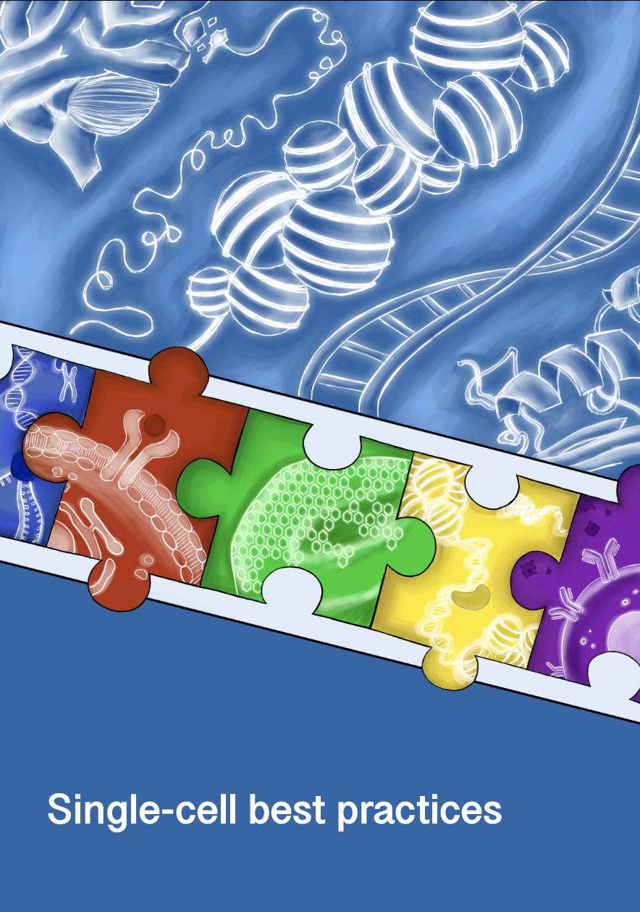

<div style="page-break-after: always;"></div>

# Single-cell best practices

```{warning}
This project is still work in progress and the content is not final yet.
If you have early feedback feel free to open issues and to get in touch with us.
Interested in contributing? Please have a look at https://github.com/theislab/single-cell-best-practices/blob/development/CONTRIBUTING.md
```

## Introduction

The human body is a complex machine that heavily relies on the basic units of life - cells. These cells exhibit remarkable diversity, varying in type and function, and can undergo significant transitions during development, in response to disease, or during regenerative processes. This cellular heterogeneity manifests in their structure, function, and gene expression profiles. Disruptions to this delicate balance can lead to systemic dysregulation, contributing to severe conditions such as cancer{cite}`Macaulay2017`. Therefore, understanding how cells behave under normal and perturbated states is critical for improving our knowledge of the entire cellular systems.

To address this challenge, researchers employ a variety of strategies, with one of the most promising being profiling cells at the individual level. Traditionally, each cells' transcriptome was primarily examined in a process known as single-cell RNA sequencing. However, recent advancements in single-cell genomics now enable the integration of transcriptome data with spatial, chromatin accessibility, or protein-level information. These developments not only enhance our understanding of complex regulatory mechanisms but also introduce additional challenges in data analysis.

Currently, analysts are faced with an overwhelming array of computational tools—over 1,000 methods dedicated to single-cell analysis alone. Navigating this extensive landscape to produce reliable, cutting-edge results poses a significant challenge.

## What this book covers

This book aims to guide both beginners and experienced professionals in **best practices** of single-cell sequencing analysis. It provides a comprehensive overview of essential analytical steps, from preprocessing to visualization and statistical evaluation and beyond. By following this book, readers will acquire the skills to independently analyze unimodal and multimodal single-cell sequencing data.

The recommendations presented are grounded in external benchmarks and reviews wherever possible, ensuring the approaches taught are both effective and reliable. Additionally, this book is designed to serve as a dynamic resource, evolving with the field to reflect new insights and updated best practices.

## What this book does not cover

This book does not cover fundamental concepts of biology or computer science, including basic programming skills. Nor does it serve as an exhaustive catalog of all available tools for specific tasks. Instead, it emphasizes well-validated methods that have been externally benchmarked or recognized as community standards. When such external validation is unavailable, our recommendations are only based on our extensive practical experience.

## Structure of the book

Each chapter corresponds to a distinct phase of a typical single-cell data analysis project. While an analysis workflow should generally follow the order of the chapters, flexibility is encouraged depending on specific downstream analysis objectives. Each chapter is supplemented with extensive references, and readers are encouraged to consult these primary sources for a deeper understanding. Although we strive to provide comprehensive background information, our summaries may not capture the full scope of reasoning behind every recommendation.

## Prerequisites

Bioinformatics is inherently multidisciplinary, requiring knowledge of both biology and computer science. Single-cell analysis is particularly demanding, as it integrates multiple subfields and often involves large datasets. While this book cannot cover all the necessary foundational knowledge for computational single-cell analysis, we recommend the following resources to enhance your learning experience:

- **Basic Python programming**: Familiarity with control flow (e.g., loops, conditional statements), basic data structures (e.g., lists, dictionaries, sets), and key libraries such as Pandas and Numpy is essential. Newcomers can benefit from the free book [Automate the boring stuff with Python](https://automatetheboringstuff.com/).

- **AnnData and Scanpy**: While prior experience with these tools is helpful, it is not strictly required. This book provides a detailed introduction to AnnData and outlines the workflow for working with Scanpy. However, it does not cover the full range of Scanpy’s functionalities. To deepen your understanding, we recommend exploring the [scanpy tutorials](https://scanpy.readthedocs.io/en/stable/tutorials.html) and referring to the [scanpy API reference](https://scanpy.readthedocs.io/en/stable/api.html) as needed.

- **Multimodal Data Analysis**: For readers who have interest in multimodal data analysis, understanding tools like muon and MuData is beneficial. The [muon tutorials](https://muon-tutorials.readthedocs.io/en/latest/) provide a solid introduction to this field.

- **Basic R Programming**: Knowledge of control flow and basic data structures suffices. New learners can refer to [R for data science](https://r4ds.had.co.nz/) for a comprehensive introduction.

- **Basic Biology**: While this book offers a rough overview of data generation, it does not cover fundamental topics like {term}`DNA`, RNA, and proteins. _Molecular Biology of the Cell_ by Bruce Alberts et al. is a recommended resource for those new to molecular biology.

## Peer-review

Although the content has been reviewed by multiple authors, editors, and external experts, this book has not undergone formal peer review. We encourage readers to provide constructive feedback to help refine and improve the material.

## Citation

If you found our content helpful for your research, please cite it as:

> Heumos, L., Schaar, A.C., Lance, C. et al. Best practices for single-cell analysis across modalities. Nat Rev Genet (2023). https://doi.org/10.1038/s41576-023-00586-w

## Contributing

We invite the community to contribute to the ongoing improvement of this tutorial and teaching material. Please read [contributing](https://github.com/theislab/single-cell-best-practices/blob/development/CONTRIBUTING.md) for further instructions.

In case of questions or problems, please get in touch by posting an issue in this repository.

## Alternative formats

PDF versions of this book are available on our [releases page](https://github.com/theislab/single-cell-best-practices/releases).

## Contact us

You can report issues and requests in our [issue tracker](https://github.com/theislab/single-cell-best-practices/issues).

For inquiries, speaking engagements, or collaboration opportunities, please email:

- Anna Schaar: anna DOT schaar AT helmholtz-munich DOT de
- Lukas Heumos: lukas DOT heumos AT helmholtz-munich DOT de.

## License

This book is licensed under the [Apache 2.0 license](https://github.com/theislab/single-cell-best-practices/blob/development/LICENSE).

## References

```{bibliography}
:filter: docname in docnames
```
